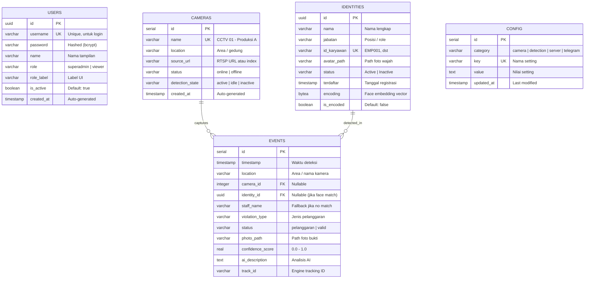

# 🗄️ ERD — CCTV-SOP Dashboard (Keseluruhan)

> Database belum ada. Dokumen ini adalah **blueprint** untuk pembuatan database dari nol.  
> Semua tabel, kolom, dan relasi didasarkan pada analisis 7 fitur frontend.

---

## 📐 Entity Relationship Diagram



---

## 📊 Penjelasan Tabel

### 1. `users` — Authentication

Untuk login dan RBAC. **Tidak berelasi** dengan tabel lain (events di-generate otomatis oleh AI Engine, bukan oleh user).

| Kolom        | Tipe         | Constraint       | Keterangan                       |
| ------------ | ------------ | ---------------- | -------------------------------- |
| `id`         | UUID         | PK               | Generate server-side             |
| `username`   | VARCHAR(50)  | UNIQUE, NOT NULL | Untuk login                      |
| `password`   | VARCHAR(255) | NOT NULL         | **Hashed** (bcrypt cost ≥ 10)    |
| `name`       | VARCHAR(100) | NOT NULL         | Nama tampilan di sidebar         |
| `role`       | VARCHAR(20)  | NOT NULL         | `'superadmin'` \| `'viewer'`     |
| `role_label` | VARCHAR(50)  |                  | Label UI ("Super Administrator") |
| `is_active`  | BOOLEAN      | DEFAULT true     | Soft-disable tanpa delete        |
| `created_at` | TIMESTAMP    | DEFAULT NOW()    |                                  |

> [!IMPORTANT]
> Password **WAJIB** disimpan sebagai hash. Jangan pernah simpan plaintext.

---

### 2. `cameras` — Sumber CCTV

Representasi kamera fisik. Di frontend (`App.jsx`) sudah ada `MOCK_CCTV` array 4 kamera — tabel ini menggantikan mock tersebut.

| Kolom             | Tipe         | Constraint         | Keterangan                             |
| ----------------- | ------------ | ------------------ | -------------------------------------- |
| `id`              | SERIAL       | PK                 | Auto-increment                         |
| `name`            | VARCHAR(100) | UNIQUE, NOT NULL   | "CCTV 01 - Produksi A"                 |
| `location`        | VARCHAR(100) |                    | Area fisik                             |
| `source_url`      | VARCHAR(255) |                    | RTSP URL atau "0" (webcam)             |
| `status`          | VARCHAR(20)  | DEFAULT 'offline'  | `'online'` \| `'offline'`              |
| `detection_state` | VARCHAR(20)  | DEFAULT 'inactive' | `'active'` \| `'idle'` \| `'inactive'` |
| `created_at`      | TIMESTAMP    | DEFAULT NOW()      |                                        |

---

### 3. `identities` — Staff / Wajah

Data karyawan + face encoding untuk dikenali oleh AI Engine saat deteksi real-time.

| Kolom         | Tipe         | Constraint       | Keterangan                        |
| ------------- | ------------ | ---------------- | --------------------------------- |
| `id`          | UUID         | PK               |                                   |
| `nama`        | VARCHAR(100) | NOT NULL         | Nama lengkap                      |
| `jabatan`     | VARCHAR(50)  |                  | Posisi / jabatan                  |
| `id_karyawan` | VARCHAR(20)  | UNIQUE, NOT NULL | "EMP001"                          |
| `avatar_path` | VARCHAR(255) |                  | Path ke foto wajah                |
| `status`      | VARCHAR(20)  | DEFAULT 'Active' | `'Active'` \| `'Inactive'`        |
| `terdaftar`   | TIMESTAMP    | DEFAULT NOW()    |                                   |
| `encoding`    | BYTEA / JSON |                  | Face embedding vector (128/512-d) |
| `is_encoded`  | BOOLEAN      | DEFAULT false    | Sudah di-encode atau belum        |

> [!NOTE]
> Field `encoding` berisi float array dari face recognition model.  
> Disimpan sebagai BYTEA (binary) atau JSONB tergantung preferensi query.

---

### 4. `events` — Insiden + Laporan (Merged)

**Tabel utama.** Menggabungkan data dari halaman History dan Reports. Setiap row = 1 deteksi AI.

| Kolom              | Tipe         | Constraint                   | Keterangan                                         |
| ------------------ | ------------ | ---------------------------- | -------------------------------------------------- |
| `id`               | SERIAL       | PK                           | Auto-increment                                     |
| `timestamp`        | TIMESTAMP    | NOT NULL, DEFAULT NOW()      | Waktu deteksi                                      |
| `location`         | VARCHAR(100) |                              | Area / nama kamera (denormalized)                  |
| `camera_id`        | INTEGER      | FK → cameras.id, NULLABLE    | Kamera mana yang capture                           |
| `identity_id`      | UUID         | FK → identities.id, NULLABLE | Staff yang terdeteksi (jika face match)            |
| `staff_name`       | VARCHAR(100) |                              | Nama fallback jika identity tidak match            |
| `violation_type`   | VARCHAR(100) |                              | "Helm Tidak Dipakai", "Baju Tidak Dimasukkan", dst |
| `status`           | VARCHAR(20)  | NOT NULL                     | `'pelanggaran'` \| `'valid'`                       |
| `photo_path`       | VARCHAR(255) |                              | Path ke foto bukti (nullable)                      |
| `confidence_score` | REAL         |                              | 0.0 – 1.0                                          |
| `ai_description`   | TEXT         |                              | Analisis AI lengkap                                |
| `track_id`         | VARCHAR(50)  |                              | Tracking ID dari engine                            |

**Relasi:**

- `camera_id` → `cameras.id` (opsional, karena bisa juga pakai `location` string)
- `identity_id` → `identities.id` (nullable, hanya terisi jika face berhasil di-match)

> [!TIP]
> Kolom `location` sengaja **denormalized** — supaya query tetap cepat tanpa JOIN ke cameras untuk sekadar tampilkan nama area.

---

### 5. `config` — System Settings

Key-value store untuk konfigurasi sistem. Lebih fleksibel daripada single JSON column.

| Kolom        | Tipe        | Constraint       | Keterangan                                        |
| ------------ | ----------- | ---------------- | ------------------------------------------------- |
| `id`         | SERIAL      | PK               |                                                   |
| `category`   | VARCHAR(30) | NOT NULL         | Grup: `camera`, `detection`, `server`, `telegram` |
| `key`        | VARCHAR(50) | UNIQUE, NOT NULL | Nama setting                                      |
| `value`      | TEXT        |                  | Nilai (string, parse ke tipe yang sesuai)         |
| `updated_at` | TIMESTAMP   | DEFAULT NOW()    |                                                   |

**Default rows yang perlu di-seed:**

| Category  | Key                       | Default Value |
| --------- | ------------------------- | ------------- |
| camera    | `camera_source`           | `"0"`         |
| camera    | `detection_duration`      | `"3"`         |
| camera    | `cooldown_minutes`        | `"5"`         |
| detection | `conf_person`             | `"0.65"`      |
| detection | `conf_sop`                | `"0.70"`      |
| detection | `face_distance_threshold` | `"0.45"`      |
| server    | `server_fps`              | `"30"`        |
| server    | `server_quality`          | `"85"`        |
| telegram  | `telegram_enabled`        | `"false"`     |
| telegram  | `telegram_bot_token`      | `""`          |
| telegram  | `telegram_chat_id`        | `""`          |

> [!WARNING]
> `telegram_bot_token` adalah data sensitif — **enkripsi** saat simpan, jangan return plaintext di GET response.

---

## 🔗 Ringkasan Relasi

```
users           (standalone — auth only)
cameras   ──1:N──  events     (kamera mana yang capture)
identities──1:N──  events     (staff siapa yang terdeteksi)
config          (standalone — key-value settings)
```

| Dari     | Ke           | Tipe | FK                                     | Nullable? |
| -------- | ------------ | ---- | -------------------------------------- | --------- |
| `events` | `cameras`    | N:1  | `events.camera_id` → `cameras.id`      | ✅ Yes    |
| `events` | `identities` | N:1  | `events.identity_id` → `identities.id` | ✅ Yes    |

---

## 📁 Index Recommendations

```sql
-- Events (tabel paling sering di-query)
CREATE INDEX idx_events_timestamp ON events (timestamp DESC);
CREATE INDEX idx_events_status ON events (status);
CREATE INDEX idx_events_camera ON events (camera_id);
CREATE INDEX idx_events_identity ON events (identity_id);

-- Config (lookup by key)
CREATE UNIQUE INDEX idx_config_key ON config (key);

-- Identities (search by name)
CREATE INDEX idx_identities_nama ON identities (nama);
```
