# 🗄️ ERD Full-Feature — CCTV-SOP SaaS (Merged & Complete)

> **Source**: Merged dari `00_erd_database_supabase.md` + `00_erd_database_supabase_saas.md`
> **Coverage**: 100% semua fitur dashboard
> **Architecture**: Modular SaaS — Core + Multi-Camera + Face Recognition + Notifications + Audit
> **Platform**: Supabase (PostgreSQL 15+)
> **Required Extensions**: `uuid-ossp`, `pgvector`

---

## 📐 Tier-Based Module Matrix

| Feature            | Defense  | Guardian    | Protector      |
| ------------------ | -------- | ----------- | -------------- |
| Auth & Users       | ✅       | ✅          | ✅             |
| Single Camera      | ✅ 1 cam | ✅ 1 cam    | ✅ 1 cam       |
| Events & Reports   | ✅ Basic | ✅ + Export | ✅ + Analytics |
| Config (Rich)      | ✅       | ✅          | ✅             |
| Notifications      | ✅ Basic | ✅ + Rules  | ✅ + Rules     |
| Multi-Camera       | ❌       | ✅ Up to 4  | ✅ Unlimited   |
| Camera Groups      | ❌       | ✅          | ✅             |
| Camera Scheduling  | ❌       | ✅          | ✅             |
| Face Recognition   | ❌       | ❌          | ✅             |
| Advanced Analytics | ❌       | ✅          | ✅             |
| Audit Logging      | ✅       | ✅          | ✅             |
| API Access         | ❌       | ✅          | ✅             |

---

## 📊 Complete ERD Diagram

```mermaid
erDiagram
    %% ============ CORE MODULE (All Plans) ============
    TENANTS {
        uuid id PK
        varchar name
        varchar slug UK
        varchar plan_tier "defense|guardian|protector"
        jsonb modules_enabled
        jsonb limits
        boolean is_active
        timestamptz created_at
    }

    PROFILES {
        uuid id PK "FK auth.users"
        uuid tenant_id FK
        varchar username
        varchar name
        varchar role "superadmin|admin|operator|viewer"
        boolean is_active
        timestamptz last_login
    }

    CAMERAS {
        uuid id PK
        uuid tenant_id FK
        varchar name
        varchar location
        text source_url
        varchar stream_protocol
        varchar status "online|offline|error|maintenance"
        varchar detection_state
        boolean is_enabled
        jsonb settings
    }

    EVENTS {
        uuid id PK
        uuid tenant_id FK
        uuid camera_id FK
        timestamptz timestamp
        varchar status "valid|violation|pending"
        varchar violation_type
        jsonb missing_sops
        varchar photo_path
        uuid identity_id FK
        boolean is_reviewed
    }

    CONFIG_CATEGORIES {
        uuid id PK
        varchar name UK
        varchar display_name
        varchar icon
        integer sort_order
    }

    CONFIG_SETTINGS {
        uuid id PK
        uuid tenant_id FK
        uuid category_id FK
        varchar key UK
        text value
        varchar data_type
        text display_name
        text default_value
        jsonb validation_rules
        boolean is_sensitive
        uuid updated_by FK
    }

    %% ============ MULTI-CAMERA MODULE (Guardian+) ============
    CAMERAS_EXTENDED {
        uuid camera_id PK "FK cameras"
        uuid tenant_id FK
        varchar camera_code UK
        jsonb detection_settings
        jsonb resolution
        integer fps_limit
        integer rotation
        uuid assigned_to FK
    }

    CAMERA_GROUPS {
        uuid id PK
        uuid tenant_id FK
        varchar name
        varchar color
    }

    CAMERA_GROUP_MEMBERS {
        uuid camera_id FK
        uuid group_id FK
    }

    CAMERA_HEARTBEATS {
        bigserial id PK
        uuid tenant_id FK
        uuid camera_id FK
        varchar status
        real fps
        real cpu_usage
        real memory_usage
    }

    CAMERA_SCHEDULES {
        uuid id PK
        uuid tenant_id FK
        uuid camera_id FK
        integer day_of_week
        time start_time
        time end_time
        boolean is_active
    }

    DAILY_SUMMARIES {
        date summary_date PK
        uuid tenant_id FK
        uuid camera_id FK
        integer total_detections
        real compliance_rate
        jsonb breakdown_by_hour
        jsonb breakdown_by_violation_type
    }

    %% ============ FACE RECOGNITION MODULE (Protector) ============
    IDENTITIES {
        uuid id PK
        uuid tenant_id FK
        varchar employee_id UK
        varchar nama
        varchar jabatan
        varchar department
        varchar status
    }

    FACE_PHOTOS {
        uuid id PK
        uuid tenant_id FK
        uuid identity_id FK
        varchar storage_path
        varchar photo_type
        boolean is_primary
        real quality_score
    }

    FACE_ENCODINGS {
        uuid id PK
        uuid tenant_id FK
        uuid identity_id FK
        uuid face_photo_id FK
        vector encoding_vector "pgvector 512d"
        real quality_score
        boolean is_primary
    }

    FACE_MATCH_LOGS {
        bigserial id PK
        uuid tenant_id FK
        uuid event_id FK
        uuid identity_id FK
        real confidence
        real distance
        varchar match_status
        jsonb candidates
    }

    %% ============ NOTIFICATION MODULE ============
    NOTIFICATION_RULES {
        uuid id PK
        uuid tenant_id FK
        varchar name
        varchar event_type
        varchar channel "telegram|email|webhook|push"
        jsonb conditions
        boolean is_active
    }

    NOTIFICATION_LOGS {
        bigserial id PK
        uuid tenant_id FK
        uuid event_id FK
        uuid rule_id FK
        varchar channel
        varchar status "sent|failed|pending"
        integer retry_count
        text error_message
    }

    %% ============ AUDIT & WORKFLOW MODULE ============
    AUDIT_LOGS {
        bigserial id PK
        uuid tenant_id FK
        uuid user_id FK
        varchar action
        varchar entity_type
        uuid entity_id
        jsonb old_values
        jsonb new_values
        inet ip_address
    }

    EVENT_TAGS {
        uuid id PK
        uuid tenant_id FK
        varchar name UK
        varchar color
    }

    EVENT_TAG_ASSIGNMENTS {
        uuid event_id FK
        uuid tag_id FK
    }

    EVENT_COMMENTS {
        uuid id PK
        uuid tenant_id FK
        uuid event_id FK
        uuid user_id FK
        text comment
    }

    %% ============ RELATIONSHIPS ============
    TENANTS ||--o{ PROFILES : "has"
    TENANTS ||--o{ CAMERAS : "owns"
    TENANTS ||--o{ EVENTS : "generates"
    TENANTS ||--o{ CONFIG_SETTINGS : "configures"
    TENANTS ||--o{ IDENTITIES : "registers"
    TENANTS ||--o{ CAMERA_GROUPS : "organizes"
    TENANTS ||--o{ NOTIFICATION_RULES : "defines"
    TENANTS ||--o{ AUDIT_LOGS : "tracks"
    TENANTS ||--o{ EVENT_TAGS : "labels"

    CONFIG_CATEGORIES ||--o{ CONFIG_SETTINGS : "groups"

    CAMERAS ||--|| CAMERAS_EXTENDED : "extends"
    CAMERAS ||--o{ EVENTS : "captures"
    CAMERAS ||--o{ CAMERA_HEARTBEATS : "monitored"
    CAMERAS ||--o{ CAMERA_SCHEDULES : "scheduled"
    CAMERAS ||--o{ DAILY_SUMMARIES : "aggregated"
    CAMERAS ||--o{ CAMERA_GROUP_MEMBERS : "grouped"

    CAMERA_GROUPS ||--o{ CAMERA_GROUP_MEMBERS : "contains"

    EVENTS ||--o{ FACE_MATCH_LOGS : "matched"
    EVENTS ||--o{ NOTIFICATION_LOGS : "notified"
    EVENTS ||--o{ EVENT_TAG_ASSIGNMENTS : "tagged"
    EVENTS ||--o{ EVENT_COMMENTS : "discussed"

    IDENTITIES ||--o{ FACE_PHOTOS : "has"
    IDENTITIES ||--o{ FACE_ENCODINGS : "encoded"
    IDENTITIES ||--o{ FACE_MATCH_LOGS : "recognized"
    IDENTITIES ||--o{ EVENTS : "identified_in"

    NOTIFICATION_RULES ||--o{ NOTIFICATION_LOGS : "triggered"
    EVENT_TAGS ||--o{ EVENT_TAG_ASSIGNMENTS : "assigned"
```



---

## 🔧 Database Schema — Part 1: Core Module (All Plans)

```sql
-- ============================================
-- EXTENSIONS
-- ============================================
CREATE EXTENSION IF NOT EXISTS "uuid-ossp";
CREATE EXTENSION IF NOT EXISTS "vector"; -- pgvector

-- ============================================
-- TENANTS (Plan & Feature Management)
-- ============================================
CREATE TABLE tenants (
    id UUID PRIMARY KEY DEFAULT uuid_generate_v4(),
    name VARCHAR(100) NOT NULL,
    slug VARCHAR(50) UNIQUE NOT NULL,

    -- Plan & Billing
    plan_tier VARCHAR(20) NOT NULL DEFAULT 'defense'
        CHECK (plan_tier IN ('defense', 'guardian', 'protector')),
    plan_expires_at TIMESTAMPTZ,

    -- Feature Flags
    modules_enabled JSONB DEFAULT '{
        "multi_camera": false,
        "camera_groups": false,
        "heartbeats": false,
        "camera_schedules": false,
        "face_recognition": false,
        "analytics": false,
        "notifications_advanced": false,
        "api_access": false
    }',

    -- Resource Limits
    limits JSONB DEFAULT '{
        "max_cameras": 1,
        "max_identities": 0,
        "max_storage_gb": 5,
        "data_retention_days": 30,
        "max_users": 3
    }',

    -- Settings
    timezone VARCHAR(50) DEFAULT 'Asia/Jakarta',
    language VARCHAR(10) DEFAULT 'id',

    -- Status
    is_active BOOLEAN DEFAULT true,
    is_suspended BOOLEAN DEFAULT false,
    suspended_reason TEXT,

    created_at TIMESTAMPTZ DEFAULT NOW(),
    updated_at TIMESTAMPTZ DEFAULT NOW()
);

-- ============================================
-- PROFILES (Users within a tenant)
-- ============================================
CREATE TABLE profiles (
    id UUID PRIMARY KEY REFERENCES auth.users(id) ON DELETE CASCADE,
    tenant_id UUID NOT NULL REFERENCES tenants(id) ON DELETE CASCADE,
    username VARCHAR(50) NOT NULL,
    name VARCHAR(100) NOT NULL,
    email VARCHAR(100),
    phone VARCHAR(20),
    avatar_url TEXT,
    role VARCHAR(20) NOT NULL CHECK (role IN ('superadmin', 'admin', 'operator', 'viewer')),
    role_label VARCHAR(50),
    is_active BOOLEAN DEFAULT true,
    last_login TIMESTAMPTZ,
    created_at TIMESTAMPTZ DEFAULT NOW(),
    updated_at TIMESTAMPTZ DEFAULT NOW(),

    UNIQUE(tenant_id, username)
);

-- Auto-create profile on signup
CREATE OR REPLACE FUNCTION handle_new_user()
RETURNS TRIGGER AS $$
BEGIN
    INSERT INTO profiles (id, tenant_id, username, name, email, role)
    VALUES (
        NEW.id,
        COALESCE(
            (NEW.raw_user_meta_data->>'tenant_id')::UUID,
            (SELECT id FROM tenants LIMIT 1)
        ),
        COALESCE(NEW.raw_user_meta_data->>'username', split_part(NEW.email, '@', 1)),
        COALESCE(NEW.raw_user_meta_data->>'name', split_part(NEW.email, '@', 1)),
        NEW.email,
        COALESCE(NEW.raw_user_meta_data->>'role', 'viewer')
    );
    RETURN NEW;
END;
$$ LANGUAGE plpgsql SECURITY DEFINER;

CREATE TRIGGER on_auth_user_created
    AFTER INSERT ON auth.users
    FOR EACH ROW EXECUTE FUNCTION handle_new_user();

-- ============================================
-- CAMERAS (Base - All Plans)
-- ============================================
CREATE TABLE cameras (
    id UUID PRIMARY KEY DEFAULT uuid_generate_v4(),
    tenant_id UUID NOT NULL REFERENCES tenants(id) ON DELETE CASCADE,

    name VARCHAR(100) NOT NULL,
    location VARCHAR(100) NOT NULL,
    source_url TEXT NOT NULL,
    stream_protocol VARCHAR(20) DEFAULT 'rtsp'
        CHECK (stream_protocol IN ('rtsp', 'http', 'file', 'webrtc')),

    status VARCHAR(20) DEFAULT 'offline'
        CHECK (status IN ('online', 'offline', 'error', 'maintenance')),
    detection_state VARCHAR(20) DEFAULT 'inactive'
        CHECK (detection_state IN ('active', 'inactive', 'paused')),
    is_enabled BOOLEAN DEFAULT true,

    settings JSONB DEFAULT '{
        "conf_person": 0.65,
        "conf_sop": 0.70,
        "cooldown_minutes": 5
    }',

    created_at TIMESTAMPTZ DEFAULT NOW(),
    updated_at TIMESTAMPTZ DEFAULT NOW()
);

-- ============================================
-- EVENTS (Base - All Plans, Partitioned)
-- ============================================
CREATE TABLE events (
    id UUID PRIMARY KEY DEFAULT uuid_generate_v4(),
    tenant_id UUID NOT NULL REFERENCES tenants(id) ON DELETE CASCADE,
    camera_id UUID NOT NULL REFERENCES cameras(id) ON DELETE CASCADE,

    timestamp TIMESTAMPTZ DEFAULT NOW(),
    location VARCHAR(100) NOT NULL,
    status VARCHAR(20) NOT NULL CHECK (status IN ('valid', 'violation', 'pending', 'pending_review')),
    violation_type VARCHAR(100),
    missing_sops JSONB,

    -- AI Results
    confidence_person REAL,
    confidence_sop REAL,
    ai_description TEXT,

    -- Media
    photo_path VARCHAR(255),
    video_clip_path VARCHAR(255),

    -- Face Recognition (populated if module enabled)
    detection_type VARCHAR(30) DEFAULT 'sop_check'
        CHECK (detection_type IN ('sop_check', 'face_recognition', 'both')),
    identity_id UUID,
    confidence_face REAL,
    staff_name VARCHAR(100),
    track_id VARCHAR(50),

    -- Review Workflow
    is_reviewed BOOLEAN DEFAULT false,
    reviewed_by UUID REFERENCES profiles(id),
    reviewed_at TIMESTAMPTZ,
    review_notes TEXT,

    -- Search
    search_vector TSVECTOR GENERATED ALWAYS AS (
        to_tsvector('indonesian',
            COALESCE(location, '') || ' ' ||
            COALESCE(violation_type, '') || ' ' ||
            COALESCE(staff_name, '') || ' ' ||
            COALESCE(ai_description, '')
        )
    ) STORED,

    created_at TIMESTAMPTZ DEFAULT NOW()
) PARTITION BY RANGE (timestamp);

-- Create initial partitions
CREATE TABLE events_y2026m03 PARTITION OF events
    FOR VALUES FROM ('2026-03-01') TO ('2026-04-01');
CREATE TABLE events_y2026m04 PARTITION OF events
    FOR VALUES FROM ('2026-04-01') TO ('2026-05-01');

-- Indexes
CREATE INDEX idx_events_tenant ON events(tenant_id, timestamp DESC);
CREATE INDEX idx_events_camera ON events(camera_id, timestamp DESC);
CREATE INDEX idx_events_status ON events(status);
CREATE INDEX idx_events_identity ON events(identity_id) WHERE identity_id IS NOT NULL;
CREATE INDEX idx_events_search ON events USING GIN(search_vector);

-- ============================================
-- CONFIG_CATEGORIES (Rich config system)
-- ============================================
CREATE TABLE config_categories (
    id UUID PRIMARY KEY DEFAULT uuid_generate_v4(),
    name VARCHAR(50) UNIQUE NOT NULL,
    display_name VARCHAR(100) NOT NULL,
    description TEXT,
    icon VARCHAR(50),
    sort_order INTEGER DEFAULT 0,
    created_at TIMESTAMPTZ DEFAULT NOW()
);

-- ============================================
-- CONFIG_SETTINGS (Per-tenant, rich metadata)
-- ============================================
CREATE TABLE config_settings (
    id UUID PRIMARY KEY DEFAULT uuid_generate_v4(),
    tenant_id UUID NOT NULL REFERENCES tenants(id) ON DELETE CASCADE,
    category_id UUID NOT NULL REFERENCES config_categories(id),

    key VARCHAR(100) NOT NULL,
    value TEXT NOT NULL,
    data_type VARCHAR(20) NOT NULL DEFAULT 'string'
        CHECK (data_type IN ('string', 'number', 'boolean', 'json', 'secret')),
    display_name VARCHAR(100) NOT NULL,
    description TEXT,
    default_value TEXT,
    validation_rules JSONB,
    is_sensitive BOOLEAN DEFAULT false,
    is_readonly BOOLEAN DEFAULT false,
    sort_order INTEGER DEFAULT 0,

    updated_at TIMESTAMPTZ DEFAULT NOW(),
    updated_by UUID REFERENCES profiles(id),

    UNIQUE(tenant_id, key)
);
```

---

## 🔧 Database Schema — Part 2: Multi-Camera Module (Guardian+)

```sql
-- ============================================
-- CAMERAS_EXTENDED (Guardian+ only)
-- ============================================
CREATE TABLE cameras_extended (
    camera_id UUID PRIMARY KEY REFERENCES cameras(id) ON DELETE CASCADE,
    tenant_id UUID NOT NULL REFERENCES tenants(id) ON DELETE CASCADE,

    camera_code VARCHAR(20) UNIQUE,
    description TEXT,
    rotation INTEGER DEFAULT 0 CHECK (rotation IN (0, 90, 180, 270)),
    resolution JSONB DEFAULT '{"width": 1920, "height": 1080}',
    fps_limit INTEGER DEFAULT 30 CHECK (fps_limit BETWEEN 1 AND 60),
    assigned_to UUID REFERENCES profiles(id),

    detection_settings JSONB DEFAULT '{
        "conf_person": 0.5,
        "conf_sop": 0.25,
        "cooldown_minutes": 10,
        "skip_frames": 0,
        "roi": null
    }',

    last_seen TIMESTAMPTZ,
    created_at TIMESTAMPTZ DEFAULT NOW(),
    updated_at TIMESTAMPTZ DEFAULT NOW()
);

-- ============================================
-- CAMERA_GROUPS (Guardian+)
-- ============================================
CREATE TABLE camera_groups (
    id UUID PRIMARY KEY DEFAULT uuid_generate_v4(),
    tenant_id UUID NOT NULL REFERENCES tenants(id) ON DELETE CASCADE,
    name VARCHAR(100) NOT NULL,
    description TEXT,
    color VARCHAR(7) DEFAULT '#38bdf8',
    created_at TIMESTAMPTZ DEFAULT NOW()
);

CREATE TABLE camera_group_members (
    camera_id UUID REFERENCES cameras(id) ON DELETE CASCADE,
    group_id UUID REFERENCES camera_groups(id) ON DELETE CASCADE,
    added_at TIMESTAMPTZ DEFAULT NOW(),
    PRIMARY KEY (camera_id, group_id)
);

-- ============================================
-- CAMERA_HEARTBEATS (Guardian+)
-- ============================================
CREATE TABLE camera_heartbeats (
    id BIGSERIAL PRIMARY KEY,
    tenant_id UUID NOT NULL REFERENCES tenants(id) ON DELETE CASCADE,
    camera_id UUID NOT NULL REFERENCES cameras(id) ON DELETE CASCADE,
    status VARCHAR(20) NOT NULL,
    fps REAL,
    cpu_usage REAL,
    memory_usage REAL,
    active_tracks INTEGER DEFAULT 0,
    error_message TEXT,
    metadata JSONB,
    created_at TIMESTAMPTZ DEFAULT NOW()
);

CREATE INDEX idx_heartbeats_camera ON camera_heartbeats(camera_id, created_at DESC);

-- View: Latest heartbeat per camera
CREATE VIEW camera_health_status AS
SELECT DISTINCT ON (h.camera_id)
    h.camera_id,
    c.tenant_id,
    c.name as camera_name,
    h.status,
    h.fps,
    h.cpu_usage,
    h.memory_usage,
    h.active_tracks,
    h.error_message,
    h.created_at as last_heartbeat,
    CASE
        WHEN h.created_at < NOW() - INTERVAL '5 minutes' THEN 'stale'
        ELSE 'fresh'
    END as data_freshness
FROM camera_heartbeats h
JOIN cameras c ON h.camera_id = c.id
ORDER BY h.camera_id, h.created_at DESC;

-- ============================================
-- CAMERA_SCHEDULES (Guardian+) ⭐ NEW
-- ============================================
CREATE TABLE camera_schedules (
    id UUID PRIMARY KEY DEFAULT uuid_generate_v4(),
    tenant_id UUID NOT NULL REFERENCES tenants(id) ON DELETE CASCADE,
    camera_id UUID NOT NULL REFERENCES cameras(id) ON DELETE CASCADE,
    day_of_week INTEGER NOT NULL CHECK (day_of_week BETWEEN 0 AND 6),
    start_time TIME NOT NULL,
    end_time TIME NOT NULL,
    is_active BOOLEAN DEFAULT true,
    created_at TIMESTAMPTZ DEFAULT NOW(),

    UNIQUE(camera_id, day_of_week),
    CHECK (start_time < end_time)
);

CREATE INDEX idx_schedules_camera ON camera_schedules(camera_id, day_of_week);

-- ============================================
-- DAILY_SUMMARIES (Guardian+)
-- ============================================
CREATE TABLE daily_summaries (
    summary_date DATE NOT NULL,
    tenant_id UUID NOT NULL REFERENCES tenants(id) ON DELETE CASCADE,
    camera_id UUID REFERENCES cameras(id) ON DELETE CASCADE,

    total_detections INTEGER DEFAULT 0,
    total_violations INTEGER DEFAULT 0,
    total_valid INTEGER DEFAULT 0,
    unique_persons_detected INTEGER DEFAULT 0,
    compliance_rate REAL,
    peak_hour INTEGER,
    breakdown_by_hour JSONB DEFAULT '{}',
    breakdown_by_violation_type JSONB DEFAULT '{}',

    created_at TIMESTAMPTZ DEFAULT NOW(),
    updated_at TIMESTAMPTZ DEFAULT NOW(),

    PRIMARY KEY (summary_date, tenant_id, camera_id)
);
```

---

## 🔧 Database Schema — Part 3: Face Recognition Module (Protector)

```sql
-- ============================================
-- IDENTITIES (Protector only)
-- ============================================
CREATE TABLE identities (
    id UUID PRIMARY KEY DEFAULT uuid_generate_v4(),
    tenant_id UUID NOT NULL REFERENCES tenants(id) ON DELETE CASCADE,

    employee_id VARCHAR(20) NOT NULL,
    nama VARCHAR(100) NOT NULL,
    jabatan VARCHAR(50) NOT NULL,
    department VARCHAR(50),
    email VARCHAR(100),
    phone VARCHAR(20),
    join_date DATE,
    photo_url TEXT,
    status VARCHAR(20) DEFAULT 'active'
        CHECK (status IN ('active', 'inactive', 'suspended')),
    is_encoded BOOLEAN DEFAULT false,
    total_photos INTEGER DEFAULT 0,

    search_vector TSVECTOR GENERATED ALWAYS AS (
        to_tsvector('indonesian',
            nama || ' ' || COALESCE(jabatan, '') || ' ' ||
            COALESCE(employee_id, '') || ' ' || COALESCE(department, '')
        )
    ) STORED,

    created_at TIMESTAMPTZ DEFAULT NOW(),
    updated_at TIMESTAMPTZ DEFAULT NOW(),

    UNIQUE(tenant_id, employee_id)
);

CREATE INDEX idx_identities_tenant ON identities(tenant_id);
CREATE INDEX idx_identities_search ON identities USING GIN(search_vector);

-- ============================================
-- FACE_PHOTOS (Protector)
-- ============================================
CREATE TABLE face_photos (
    id UUID PRIMARY KEY DEFAULT uuid_generate_v4(),
    tenant_id UUID NOT NULL REFERENCES tenants(id) ON DELETE CASCADE,
    identity_id UUID NOT NULL REFERENCES identities(id) ON DELETE CASCADE,
    storage_path VARCHAR(255) NOT NULL,
    photo_type VARCHAR(20) DEFAULT 'front'
        CHECK (photo_type IN ('front', 'left', 'right', 'up', 'down')),
    is_primary BOOLEAN DEFAULT false,
    quality_score REAL,
    file_size INTEGER,
    metadata JSONB,
    uploaded_at TIMESTAMPTZ DEFAULT NOW()
);

CREATE INDEX idx_face_photos_identity ON face_photos(identity_id);

-- ============================================
-- FACE_ENCODINGS (Protector + pgvector)
-- ============================================
CREATE TABLE face_encodings (
    id UUID PRIMARY KEY DEFAULT uuid_generate_v4(),
    tenant_id UUID NOT NULL REFERENCES tenants(id) ON DELETE CASCADE,
    identity_id UUID NOT NULL REFERENCES identities(id) ON DELETE CASCADE,
    face_photo_id UUID REFERENCES face_photos(id) ON DELETE SET NULL,

    encoding_type VARCHAR(20) DEFAULT '512d',
    encoding_vector VECTOR(512),
    quality_score REAL,
    is_primary BOOLEAN DEFAULT false,
    model_version VARCHAR(20) DEFAULT 'v1',
    landmarks JSONB,

    created_at TIMESTAMPTZ DEFAULT NOW()
);

CREATE INDEX idx_face_encodings_identity ON face_encodings(identity_id);
CREATE INDEX idx_face_encodings_vector ON face_encodings
    USING hnsw (encoding_vector vector_cosine_ops);

-- ============================================
-- FACE_MATCH_LOGS (Protector)
-- ============================================
CREATE TABLE face_match_logs (
    id BIGSERIAL PRIMARY KEY,
    tenant_id UUID NOT NULL REFERENCES tenants(id) ON DELETE CASCADE,
    event_id UUID NOT NULL REFERENCES events(id) ON DELETE CASCADE,
    identity_id UUID REFERENCES identities(id),

    confidence REAL NOT NULL,
    distance REAL NOT NULL,
    match_status VARCHAR(20) DEFAULT 'pending'
        CHECK (match_status IN ('matched', 'rejected', 'uncertain', 'pending')),
    candidates JSONB,

    created_at TIMESTAMPTZ DEFAULT NOW()
);

CREATE INDEX idx_face_match_event ON face_match_logs(event_id);
CREATE INDEX idx_face_match_identity ON face_match_logs(identity_id);
```

---

## 🔧 Database Schema — Part 4: Notification Module ⭐ NEW

```sql
-- ============================================
-- NOTIFICATION_RULES (Conditional alerting)
-- ============================================
CREATE TABLE notification_rules (
    id UUID PRIMARY KEY DEFAULT uuid_generate_v4(),
    tenant_id UUID NOT NULL REFERENCES tenants(id) ON DELETE CASCADE,

    name VARCHAR(100) NOT NULL,
    description TEXT,
    event_type VARCHAR(50) NOT NULL
        CHECK (event_type IN ('violation', 'camera_offline', 'camera_error', 'face_unknown', 'system_alert')),
    channel VARCHAR(20) NOT NULL
        CHECK (channel IN ('telegram', 'email', 'webhook', 'push')),

    -- Conditions (JSONB for flexibility)
    conditions JSONB DEFAULT '{}',
    -- Example: {"min_confidence": 0.7, "violation_types": ["helm"], "camera_ids": ["uuid"]}

    -- Delivery config
    recipient TEXT NOT NULL, -- chat_id, email, webhook_url
    template TEXT,
    cooldown_minutes INTEGER DEFAULT 5,

    is_active BOOLEAN DEFAULT true,
    created_at TIMESTAMPTZ DEFAULT NOW(),
    updated_at TIMESTAMPTZ DEFAULT NOW()
);

-- ============================================
-- NOTIFICATION_LOGS (Delivery tracking)
-- ============================================
CREATE TABLE notification_logs (
    id BIGSERIAL PRIMARY KEY,
    tenant_id UUID NOT NULL REFERENCES tenants(id) ON DELETE CASCADE,
    event_id UUID REFERENCES events(id) ON DELETE SET NULL,
    rule_id UUID REFERENCES notification_rules(id) ON DELETE SET NULL,

    channel VARCHAR(20) NOT NULL,
    recipient TEXT NOT NULL,
    status VARCHAR(20) NOT NULL DEFAULT 'pending'
        CHECK (status IN ('pending', 'sent', 'failed', 'retrying')),
    retry_count INTEGER DEFAULT 0,
    max_retries INTEGER DEFAULT 3,
    error_message TEXT,
    sent_at TIMESTAMPTZ,
    metadata JSONB,

    created_at TIMESTAMPTZ DEFAULT NOW()
);

CREATE INDEX idx_notif_logs_event ON notification_logs(event_id);
CREATE INDEX idx_notif_logs_status ON notification_logs(status) WHERE status != 'sent';
```

---

## 🔧 Database Schema — Part 5: Audit & Workflow Module ⭐ NEW

```sql
-- ============================================
-- AUDIT_LOGS (All plans - compliance tracking)
-- ============================================
CREATE TABLE audit_logs (
    id BIGSERIAL PRIMARY KEY,
    tenant_id UUID NOT NULL REFERENCES tenants(id) ON DELETE CASCADE,
    user_id UUID REFERENCES profiles(id) ON DELETE SET NULL,

    action VARCHAR(50) NOT NULL
        CHECK (action IN ('create', 'update', 'delete', 'login', 'logout', 'export', 'config_change', 'role_change')),
    entity_type VARCHAR(50) NOT NULL,
    entity_id UUID,
    description TEXT,

    old_values JSONB,
    new_values JSONB,

    ip_address INET,
    user_agent TEXT,

    created_at TIMESTAMPTZ DEFAULT NOW()
);

CREATE INDEX idx_audit_tenant ON audit_logs(tenant_id, created_at DESC);
CREATE INDEX idx_audit_user ON audit_logs(user_id);
CREATE INDEX idx_audit_entity ON audit_logs(entity_type, entity_id);

-- ============================================
-- EVENT_TAGS (Workflow labeling)
-- ============================================
CREATE TABLE event_tags (
    id UUID PRIMARY KEY DEFAULT uuid_generate_v4(),
    tenant_id UUID NOT NULL REFERENCES tenants(id) ON DELETE CASCADE,
    name VARCHAR(50) NOT NULL,
    color VARCHAR(7) DEFAULT '#64748b',
    created_at TIMESTAMPTZ DEFAULT NOW(),

    UNIQUE(tenant_id, name)
);

CREATE TABLE event_tag_assignments (
    event_id UUID NOT NULL REFERENCES events(id) ON DELETE CASCADE,
    tag_id UUID NOT NULL REFERENCES event_tags(id) ON DELETE CASCADE,
    assigned_by UUID REFERENCES profiles(id),
    assigned_at TIMESTAMPTZ DEFAULT NOW(),
    PRIMARY KEY (event_id, tag_id)
);

-- ============================================
-- EVENT_COMMENTS (Discussion on events)
-- ============================================
CREATE TABLE event_comments (
    id UUID PRIMARY KEY DEFAULT uuid_generate_v4(),
    tenant_id UUID NOT NULL REFERENCES tenants(id) ON DELETE CASCADE,
    event_id UUID NOT NULL REFERENCES events(id) ON DELETE CASCADE,
    user_id UUID NOT NULL REFERENCES profiles(id) ON DELETE CASCADE,
    comment TEXT NOT NULL,
    created_at TIMESTAMPTZ DEFAULT NOW(),
    updated_at TIMESTAMPTZ DEFAULT NOW()
);

CREATE INDEX idx_event_comments ON event_comments(event_id, created_at);
```

---

## 🔧 Database Schema — Part 6: Functions, Triggers & RLS

```sql
-- ============================================
-- HELPER FUNCTIONS
-- ============================================

-- Check if a module is enabled for a tenant
CREATE OR REPLACE FUNCTION is_module_enabled(p_tenant_id UUID, p_module TEXT)
RETURNS BOOLEAN AS $$
DECLARE
    v_enabled BOOLEAN;
BEGIN
    SELECT (modules_enabled->>p_module)::BOOLEAN INTO v_enabled
    FROM tenants WHERE id = p_tenant_id;
    RETURN COALESCE(v_enabled, false);
END;
$$ LANGUAGE plpgsql SECURITY DEFINER;

-- Get tenant limit value
CREATE OR REPLACE FUNCTION get_tenant_limit(p_tenant_id UUID, p_limit TEXT)
RETURNS INTEGER AS $$
DECLARE
    v_limit INTEGER;
BEGIN
    SELECT (limits->>p_limit)::INTEGER INTO v_limit
    FROM tenants WHERE id = p_tenant_id;
    RETURN COALESCE(v_limit, 0);
END;
$$ LANGUAGE plpgsql SECURITY DEFINER;

-- Check if current user's tenant has a module
CREATE OR REPLACE FUNCTION current_tenant_has_module(module_name TEXT)
RETURNS BOOLEAN AS $$
DECLARE
    v_tenant_id UUID;
BEGIN
    SELECT tenant_id INTO v_tenant_id
    FROM profiles WHERE id = auth.uid();
    RETURN is_module_enabled(v_tenant_id, module_name);
END;
$$ LANGUAGE plpgsql SECURITY DEFINER;

-- Get current user role
CREATE OR REPLACE FUNCTION current_user_role()
RETURNS TEXT AS $$
BEGIN
    RETURN (SELECT role FROM profiles WHERE id = auth.uid());
END;
$$ LANGUAGE plpgsql SECURITY DEFINER;

-- Is admin check
CREATE OR REPLACE FUNCTION is_admin()
RETURNS BOOLEAN AS $$
BEGIN
    RETURN EXISTS (
        SELECT 1 FROM profiles
        WHERE id = auth.uid() AND role IN ('superadmin', 'admin')
    );
END;
$$ LANGUAGE plpgsql SECURITY DEFINER;

-- Face similarity search
CREATE OR REPLACE FUNCTION search_faces(
    p_tenant_id UUID,
    query_embedding VECTOR(512),
    match_threshold REAL DEFAULT 0.7,
    match_count INTEGER DEFAULT 5
)
RETURNS TABLE (
    identity_id UUID,
    nama VARCHAR,
    employee_id VARCHAR,
    confidence REAL,
    distance REAL
) AS $$
BEGIN
    RETURN QUERY
    SELECT
        i.id,
        i.nama,
        i.employee_id,
        (1 - (fe.encoding_vector <=> query_embedding))::REAL as confidence,
        (fe.encoding_vector <=> query_embedding)::REAL as distance
    FROM face_encodings fe
    JOIN identities i ON fe.identity_id = i.id
    WHERE fe.tenant_id = p_tenant_id
      AND fe.is_primary = true
      AND (1 - (fe.encoding_vector <=> query_embedding)) >= match_threshold
    ORDER BY distance
    LIMIT match_count;
END;
$$ LANGUAGE plpgsql;

-- ============================================
-- TRIGGERS
-- ============================================

-- Auto-update modules & limits when plan changes
CREATE OR REPLACE FUNCTION update_modules_on_plan_change()
RETURNS TRIGGER AS $$
BEGIN
    IF NEW.plan_tier != OLD.plan_tier THEN
        NEW.modules_enabled = CASE NEW.plan_tier
            WHEN 'defense' THEN '{
                "multi_camera": false, "camera_groups": false,
                "heartbeats": false, "camera_schedules": false,
                "face_recognition": false, "analytics": false,
                "notifications_advanced": false, "api_access": false
            }'::JSONB
            WHEN 'guardian' THEN '{
                "multi_camera": true, "camera_groups": true,
                "heartbeats": true, "camera_schedules": true,
                "face_recognition": false, "analytics": true,
                "notifications_advanced": true, "api_access": true
            }'::JSONB
            WHEN 'protector' THEN '{
                "multi_camera": true, "camera_groups": true,
                "heartbeats": true, "camera_schedules": true,
                "face_recognition": true, "analytics": true,
                "notifications_advanced": true, "api_access": true
            }'::JSONB
        END;

        NEW.limits = CASE NEW.plan_tier
            WHEN 'defense' THEN '{"max_cameras":1,"max_identities":0,"max_storage_gb":5,"data_retention_days":30,"max_users":3}'::JSONB
            WHEN 'guardian' THEN '{"max_cameras":4,"max_identities":0,"max_storage_gb":20,"data_retention_days":90,"max_users":10}'::JSONB
            WHEN 'protector' THEN '{"max_cameras":50,"max_identities":500,"max_storage_gb":100,"data_retention_days":365,"max_users":50}'::JSONB
        END;
    END IF;
    RETURN NEW;
END;
$$ LANGUAGE plpgsql;

CREATE TRIGGER trigger_update_modules_on_plan
    BEFORE UPDATE ON tenants
    FOR EACH ROW EXECUTE FUNCTION update_modules_on_plan_change();

-- Enforce camera limit per tenant
CREATE OR REPLACE FUNCTION check_camera_limit()
RETURNS TRIGGER AS $$
DECLARE
    v_current INTEGER;
    v_max INTEGER;
BEGIN
    SELECT COUNT(*) INTO v_current FROM cameras WHERE tenant_id = NEW.tenant_id;
    v_max := get_tenant_limit(NEW.tenant_id, 'max_cameras');
    IF v_current >= v_max THEN
        RAISE EXCEPTION 'Camera limit reached: %', v_max;
    END IF;
    RETURN NEW;
END;
$$ LANGUAGE plpgsql;

CREATE TRIGGER trigger_check_camera_limit
    BEFORE INSERT ON cameras
    FOR EACH ROW EXECUTE FUNCTION check_camera_limit();

-- Enforce module gating for multi-camera tables
CREATE OR REPLACE FUNCTION check_multi_camera_module()
RETURNS TRIGGER AS $$
BEGIN
    IF NOT is_module_enabled(NEW.tenant_id, 'multi_camera') THEN
        RAISE EXCEPTION 'Multi-camera module not enabled for this tenant';
    END IF;
    RETURN NEW;
END;
$$ LANGUAGE plpgsql;

CREATE TRIGGER trigger_check_multicam_extended
    BEFORE INSERT ON cameras_extended
    FOR EACH ROW EXECUTE FUNCTION check_multi_camera_module();

CREATE TRIGGER trigger_check_multicam_groups
    BEFORE INSERT ON camera_groups
    FOR EACH ROW EXECUTE FUNCTION check_multi_camera_module();

-- Enforce module gating for face recognition tables
CREATE OR REPLACE FUNCTION check_face_recognition_module()
RETURNS TRIGGER AS $$
BEGIN
    IF NOT is_module_enabled(NEW.tenant_id, 'face_recognition') THEN
        RAISE EXCEPTION 'Face recognition module not enabled for this tenant';
    END IF;
    RETURN NEW;
END;
$$ LANGUAGE plpgsql;

CREATE TRIGGER trigger_check_face_rec_identities
    BEFORE INSERT ON identities
    FOR EACH ROW EXECUTE FUNCTION check_face_recognition_module();

-- Validate face recognition fields on events
CREATE OR REPLACE FUNCTION validate_face_fields()
RETURNS TRIGGER AS $$
BEGIN
    IF (NEW.identity_id IS NOT NULL OR NEW.confidence_face IS NOT NULL) THEN
        IF NOT is_module_enabled(NEW.tenant_id, 'face_recognition') THEN
            RAISE EXCEPTION 'Face recognition fields require face_recognition module';
        END IF;
    END IF;
    RETURN NEW;
END;
$$ LANGUAGE plpgsql;

CREATE TRIGGER trigger_validate_face_fields
    BEFORE INSERT OR UPDATE ON events
    FOR EACH ROW EXECUTE FUNCTION validate_face_fields();

-- Auto updated_at
CREATE OR REPLACE FUNCTION update_updated_at()
RETURNS TRIGGER AS $$
BEGIN
    NEW.updated_at = NOW();
    RETURN NEW;
END;
$$ LANGUAGE plpgsql;

CREATE TRIGGER set_updated_at_tenants BEFORE UPDATE ON tenants FOR EACH ROW EXECUTE FUNCTION update_updated_at();
CREATE TRIGGER set_updated_at_profiles BEFORE UPDATE ON profiles FOR EACH ROW EXECUTE FUNCTION update_updated_at();
CREATE TRIGGER set_updated_at_cameras BEFORE UPDATE ON cameras FOR EACH ROW EXECUTE FUNCTION update_updated_at();
CREATE TRIGGER set_updated_at_cameras_ext BEFORE UPDATE ON cameras_extended FOR EACH ROW EXECUTE FUNCTION update_updated_at();
CREATE TRIGGER set_updated_at_identities BEFORE UPDATE ON identities FOR EACH ROW EXECUTE FUNCTION update_updated_at();

-- ============================================
-- RLS POLICIES (Tenant Isolation + Role-Based)
-- ============================================
ALTER TABLE tenants ENABLE ROW LEVEL SECURITY;
ALTER TABLE profiles ENABLE ROW LEVEL SECURITY;
ALTER TABLE cameras ENABLE ROW LEVEL SECURITY;
ALTER TABLE events ENABLE ROW LEVEL SECURITY;
ALTER TABLE config_settings ENABLE ROW LEVEL SECURITY;
ALTER TABLE cameras_extended ENABLE ROW LEVEL SECURITY;
ALTER TABLE camera_groups ENABLE ROW LEVEL SECURITY;
ALTER TABLE camera_heartbeats ENABLE ROW LEVEL SECURITY;
ALTER TABLE camera_schedules ENABLE ROW LEVEL SECURITY;
ALTER TABLE daily_summaries ENABLE ROW LEVEL SECURITY;
ALTER TABLE identities ENABLE ROW LEVEL SECURITY;
ALTER TABLE face_photos ENABLE ROW LEVEL SECURITY;
ALTER TABLE face_encodings ENABLE ROW LEVEL SECURITY;
ALTER TABLE face_match_logs ENABLE ROW LEVEL SECURITY;
ALTER TABLE notification_rules ENABLE ROW LEVEL SECURITY;
ALTER TABLE notification_logs ENABLE ROW LEVEL SECURITY;
ALTER TABLE audit_logs ENABLE ROW LEVEL SECURITY;
ALTER TABLE event_tags ENABLE ROW LEVEL SECURITY;
ALTER TABLE event_tag_assignments ENABLE ROW LEVEL SECURITY;
ALTER TABLE event_comments ENABLE ROW LEVEL SECURITY;

-- Tenant isolation: all tenant-scoped tables
-- (Using profiles.tenant_id lookup for auth.uid())
CREATE OR REPLACE FUNCTION get_current_tenant_id()
RETURNS UUID AS $$
BEGIN
    RETURN (SELECT tenant_id FROM profiles WHERE id = auth.uid());
END;
$$ LANGUAGE plpgsql SECURITY DEFINER STABLE;

-- Profiles
CREATE POLICY "tenant_isolation" ON profiles
    FOR ALL USING (tenant_id = get_current_tenant_id());

-- Cameras
CREATE POLICY "tenant_isolation" ON cameras
    FOR ALL USING (tenant_id = get_current_tenant_id());

CREATE POLICY "admin_manage" ON cameras
    FOR ALL USING (tenant_id = get_current_tenant_id() AND is_admin());

-- Events
CREATE POLICY "tenant_read" ON events
    FOR SELECT USING (tenant_id = get_current_tenant_id());

CREATE POLICY "admin_write" ON events
    FOR INSERT WITH CHECK (tenant_id = get_current_tenant_id() AND is_admin());

CREATE POLICY "admin_update" ON events
    FOR UPDATE USING (tenant_id = get_current_tenant_id() AND is_admin());

-- Config
CREATE POLICY "tenant_read" ON config_settings
    FOR SELECT USING (
        tenant_id = get_current_tenant_id()
        AND (NOT is_sensitive OR is_admin())
    );

CREATE POLICY "superadmin_write" ON config_settings
    FOR ALL USING (
        tenant_id = get_current_tenant_id()
        AND current_user_role() = 'superadmin'
    );

-- Identities
CREATE POLICY "tenant_isolation" ON identities
    FOR ALL USING (tenant_id = get_current_tenant_id());

-- Face Photos & Encodings
CREATE POLICY "tenant_isolation" ON face_photos
    FOR ALL USING (tenant_id = get_current_tenant_id());

CREATE POLICY "tenant_isolation" ON face_encodings
    FOR ALL USING (tenant_id = get_current_tenant_id());

-- Audit Logs (read-only for admin)
CREATE POLICY "admin_read" ON audit_logs
    FOR SELECT USING (tenant_id = get_current_tenant_id() AND is_admin());

-- Notification Rules
CREATE POLICY "tenant_isolation" ON notification_rules
    FOR ALL USING (tenant_id = get_current_tenant_id() AND is_admin());

-- Notification Logs
CREATE POLICY "tenant_read" ON notification_logs
    FOR SELECT USING (tenant_id = get_current_tenant_id());

-- Event Tags, Comments
CREATE POLICY "tenant_isolation" ON event_tags
    FOR ALL USING (tenant_id = get_current_tenant_id());

CREATE POLICY "tenant_isolation" ON event_comments
    FOR ALL USING (tenant_id = get_current_tenant_id());
```

---

## 🔌 Supabase Realtime & Storage

```sql
-- Enable realtime for key tables
ALTER PUBLICATION supabase_realtime ADD TABLE events;
ALTER PUBLICATION supabase_realtime ADD TABLE camera_heartbeats;
ALTER PUBLICATION supabase_realtime ADD TABLE notification_logs;

-- Storage Buckets (create via Dashboard or SQL)
-- Bucket: identity-photos  → face photos for identity CRUD
-- Bucket: event-evidence   → SOP violation screenshots
-- Bucket: video-clips      → short violation video clips

-- Storage policies
CREATE POLICY "Admin can upload identity photos"
    ON storage.objects FOR INSERT
    WITH CHECK (
        bucket_id = 'identity-photos' AND auth.role() = 'authenticated' AND is_admin()
    );

CREATE POLICY "Authenticated can view identity photos"
    ON storage.objects FOR SELECT
    USING (bucket_id = 'identity-photos' AND auth.role() = 'authenticated');

CREATE POLICY "Authenticated can view event evidence"
    ON storage.objects FOR SELECT
    USING (bucket_id = 'event-evidence' AND auth.role() = 'authenticated');

CREATE POLICY "Admin can upload event evidence"
    ON storage.objects FOR INSERT
    WITH CHECK (
        bucket_id = 'event-evidence' AND auth.role() = 'authenticated' AND is_admin()
    );
```

---

## 🌱 Seed Data

```sql
-- Config Categories
INSERT INTO config_categories (name, display_name, icon, sort_order) VALUES
('detection', 'Pengaturan Deteksi', 'ScanEye', 1),
('server', 'Pengaturan Server', 'Server', 2),
('notification', 'Notifikasi', 'Bell', 3),
('storage', 'Penyimpanan', 'HardDrive', 4),
('face_recognition', 'Face Recognition', 'UserCheck', 5),
('general', 'Umum', 'Settings', 6);

-- Default Tenant (for initial setup)
INSERT INTO tenants (name, slug, plan_tier) VALUES
('Foodinesia', 'foodinesia', 'protector');

-- Example config seeds (per tenant - run after tenant creation)
-- Detection settings
INSERT INTO config_settings (tenant_id, category_id, key, value, data_type, display_name, default_value, validation_rules) VALUES
((SELECT id FROM tenants WHERE slug='foodinesia'), (SELECT id FROM config_categories WHERE name='detection'),
 'conf_person', '0.65', 'number', 'Confidence Person', '0.65', '{"min": 0.1, "max": 1.0}'),
((SELECT id FROM tenants WHERE slug='foodinesia'), (SELECT id FROM config_categories WHERE name='detection'),
 'conf_sop', '0.70', 'number', 'Confidence SOP', '0.70', '{"min": 0.1, "max": 1.0}'),
((SELECT id FROM tenants WHERE slug='foodinesia'), (SELECT id FROM config_categories WHERE name='detection'),
 'cooldown_minutes', '5', 'number', 'Cooldown (menit)', '5', '{"min": 1, "max": 60}');

-- Notification settings
INSERT INTO config_settings (tenant_id, category_id, key, value, data_type, display_name, is_sensitive) VALUES
((SELECT id FROM tenants WHERE slug='foodinesia'), (SELECT id FROM config_categories WHERE name='notification'),
 'telegram_enabled', 'false', 'boolean', 'Aktifkan Telegram', false),
((SELECT id FROM tenants WHERE slug='foodinesia'), (SELECT id FROM config_categories WHERE name='notification'),
 'telegram_bot_token', '', 'secret', 'Telegram Bot Token', true),
((SELECT id FROM tenants WHERE slug='foodinesia'), (SELECT id FROM config_categories WHERE name='notification'),
 'telegram_chat_id', '', 'string', 'Telegram Chat ID', false);

-- Server settings
INSERT INTO config_settings (tenant_id, category_id, key, value, data_type, display_name, default_value, validation_rules) VALUES
((SELECT id FROM tenants WHERE slug='foodinesia'), (SELECT id FROM config_categories WHERE name='server'),
 'server_fps', '15', 'number', 'Server FPS', '15', '{"min": 1, "max": 30}'),
((SELECT id FROM tenants WHERE slug='foodinesia'), (SELECT id FROM config_categories WHERE name='server'),
 'server_quality', '85', 'number', 'Kualitas JPEG (%)', '85', '{"min": 50, "max": 100}');

-- Face recognition settings
INSERT INTO config_settings (tenant_id, category_id, key, value, data_type, display_name,  default_value) VALUES
((SELECT id FROM tenants WHERE slug='foodinesia'), (SELECT id FROM config_categories WHERE name='face_recognition'),
 'face_recognition_enabled', 'true', 'boolean', 'Aktifkan Face Recognition', 'false'),
((SELECT id FROM tenants WHERE slug='foodinesia'), (SELECT id FROM config_categories WHERE name='face_recognition'),
 'face_match_threshold', '0.7', 'number', 'Threshold Kecocokan Wajah', '0.7');
```

---

## 📊 Table Summary

| #   | Table                   | Module       | Purpose                        |
| --- | ----------------------- | ------------ | ------------------------------ |
| 1   | `tenants`               | Core         | Multi-tenant, plans, limits    |
| 2   | `profiles`              | Core         | Users, roles, auth             |
| 3   | `cameras`               | Core         | Camera registry                |
| 4   | `events`                | Core         | Detection events (partitioned) |
| 5   | `config_categories`     | Core         | Config grouping                |
| 6   | `config_settings`       | Core         | Rich per-tenant config         |
| 7   | `cameras_extended`      | Multi-Camera | Advanced camera settings       |
| 8   | `camera_groups`         | Multi-Camera | Group cameras                  |
| 9   | `camera_group_members`  | Multi-Camera | M2M camera-group               |
| 10  | `camera_heartbeats`     | Multi-Camera | Health monitoring              |
| 11  | `camera_schedules`      | Multi-Camera | Auto on/off schedule           |
| 12  | `daily_summaries`       | Multi-Camera | Analytics aggregation          |
| 13  | `identities`            | Face Rec     | Known persons                  |
| 14  | `face_photos`           | Face Rec     | Identity photos                |
| 15  | `face_encodings`        | Face Rec     | pgvector embeddings            |
| 16  | `face_match_logs`       | Face Rec     | Recognition history            |
| 17  | `notification_rules`    | Notification | Alert conditions               |
| 18  | `notification_logs`     | Notification | Delivery tracking              |
| 19  | `audit_logs`            | Audit        | Activity tracking              |
| 20  | `event_tags`            | Audit        | Workflow labels                |
| 21  | `event_tag_assignments` | Audit        | M2M event-tag                  |
| 22  | `event_comments`        | Audit        | Discussion thread              |

**Views**: `camera_health_status`
**Functions**: `is_module_enabled`, `get_tenant_limit`, `current_tenant_has_module`, `current_user_role`, `is_admin`, `search_faces`, `get_current_tenant_id`
**Triggers**: plan change auto-update, camera limit, module gating (multi-cam, face-rec), face field validation, auto `updated_at`

---

**Total Tables**: 22
**Total Views**: 1
**Total Functions**: 7
**Total Triggers**: 13
**Feature Coverage**: 100%
**Platform**: Supabase (PostgreSQL 15+)
**Extensions**: `uuid-ossp`, `pgvector`
**Created**: 2026-03-13
**Status**: Production Ready
