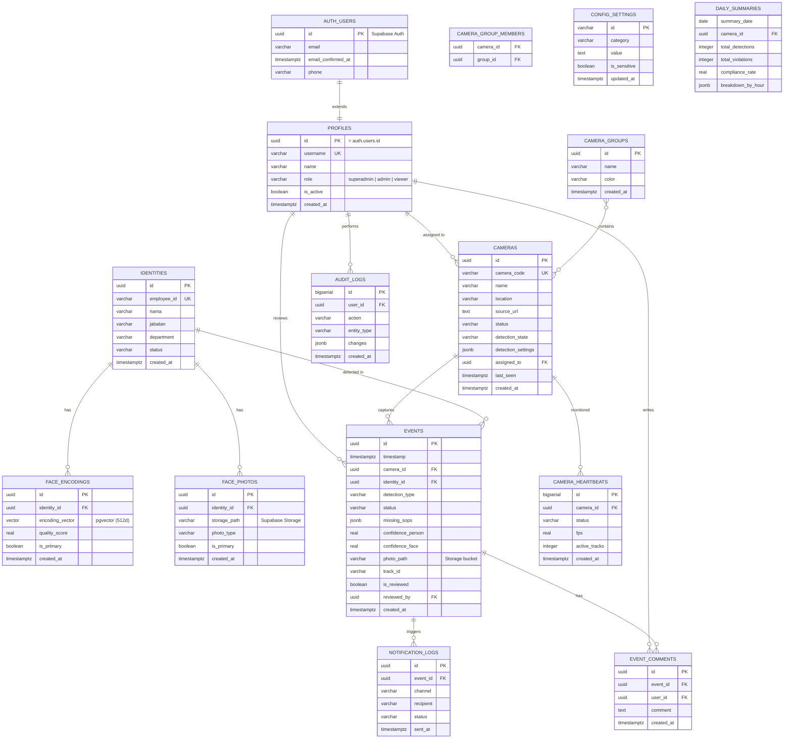

# 🗄️ ERD Supabase — CCTV-SOP Dashboard (Multi-Camera + Face Recognition)

> **Platform:** Supabase (PostgreSQL 15+)  
> **Extensions:** `pgvector`, `uuid-ossp`  
> **Features:** RLS, Storage Buckets, Realtime, Auth Integration

---

## 📐 Architecture Diagram



---

## 🔧 Supabase Setup SQL

### 1. Enable Extensions

```sql
-- Enable required extensions
CREATE EXTENSION IF NOT EXISTS "uuid-ossp";
CREATE EXTENSION IF NOT EXISTS "pgvector";

-- For full-text search (Indonesian)
CREATE TEXT SEARCH CONFIGURATION indonesian (COPY = simple);
```

### 2. Storage Buckets Setup

```sql
-- Create buckets (via Supabase Dashboard or SQL)
-- Buckets to create:
-- 1. identity-photos    : Foto wajah staff (private)
-- 2. event-evidence     : Foto bukti deteksi (private)
-- 3. video-clips        : Video clip 5 detik (private)

-- Bucket policies will be set in Dashboard or via storage API
```

**Storage Structure:**

```
identity-photos/
├── {identity_id}/
│   ├── primary.jpg
│   ├── front.jpg
│   ├── left.jpg
│   └── with_glasses.jpg

event-evidence/
├── {camera_id}/
│   ├── {date}/
│   │   ├── {event_id}_violation.jpg
│   │   └── {event_id}_valid.jpg

video-clips/
└── {camera_id}/
    └── {date}/
        └── {event_id}.mp4
```

---

## 📊 Core Tables DDL

### 🔐 Auth & Profiles

```sql
-- ============================================
-- PROFILES (Extends auth.users)
-- ============================================
CREATE TABLE profiles (
    id UUID PRIMARY KEY REFERENCES auth.users(id) ON DELETE CASCADE,
    username VARCHAR(50) UNIQUE NOT NULL,
    name VARCHAR(100) NOT NULL,
    email VARCHAR(100) UNIQUE,
    phone VARCHAR(20),
    role VARCHAR(20) NOT NULL CHECK (role IN ('superadmin', 'admin', 'viewer')),
    role_label VARCHAR(50),
    is_active BOOLEAN DEFAULT true,
    last_login TIMESTAMPTZ,
    created_at TIMESTAMPTZ DEFAULT NOW(),
    updated_at TIMESTAMPTZ DEFAULT NOW()
);

-- Trigger untuk auto-create profile saat user signup
CREATE OR REPLACE FUNCTION public.handle_new_user()
RETURNS TRIGGER AS $$
BEGIN
    INSERT INTO public.profiles (id, username, name, email, role, role_label)
    VALUES (
        NEW.id,
        NEW.raw_user_meta_data->>'username',
        NEW.raw_user_meta_data->>'name',
        NEW.email,
        COALESCE(NEW.raw_user_meta_data->>'role', 'viewer'),
        COALESCE(NEW.raw_user_meta_data->>'role_label', 'Viewer')
    );
    RETURN NEW;
END;
$$ LANGUAGE plpgsql SECURITY DEFINER;

CREATE TRIGGER on_auth_user_created
    AFTER INSERT ON auth.users
    FOR EACH ROW EXECUTE FUNCTION public.handle_new_user();

-- Update timestamp trigger
CREATE OR REPLACE FUNCTION update_updated_at_column()
RETURNS TRIGGER AS $$
BEGIN
    NEW.updated_at = NOW();
    RETURN NEW;
END;
$$ LANGUAGE plpgsql;

CREATE TRIGGER update_profiles_updated_at
    BEFORE UPDATE ON profiles
    FOR EACH ROW EXECUTE FUNCTION update_updated_at_column();
```

### 📹 Cameras Module

```sql
-- ============================================
-- CAMERAS
-- ============================================
CREATE TABLE cameras (
    id UUID PRIMARY KEY DEFAULT uuid_generate_v4(),
    camera_code VARCHAR(20) UNIQUE NOT NULL,
    name VARCHAR(100) NOT NULL,
    location VARCHAR(100) NOT NULL,
    description TEXT,
    source_url TEXT NOT NULL,
    stream_protocol VARCHAR(20) DEFAULT 'rtsp' CHECK (stream_protocol IN ('rtsp', 'http', 'file', 'webrtc')),
    rotation INTEGER DEFAULT 0 CHECK (rotation IN (0, 90, 180, 270)),
    resolution JSONB DEFAULT '{"width": 1920, "height": 1080}',
    fps_limit INTEGER DEFAULT 30,
    status VARCHAR(20) DEFAULT 'offline' CHECK (status IN ('online', 'offline', 'error', 'maintenance')),
    detection_state VARCHAR(20) DEFAULT 'inactive' CHECK (detection_state IN ('active', 'idle', 'inactive', 'error')),
    is_enabled BOOLEAN DEFAULT true,
    assigned_to UUID REFERENCES profiles(id),
    last_seen TIMESTAMPTZ,
    detection_settings JSONB DEFAULT '{
        "conf_person": 0.5,
        "conf_sop": 0.25,
        "cooldown_minutes": 10,
        "skip_frames": 0,
        "roi": null
    }',
    created_at TIMESTAMPTZ DEFAULT NOW(),
    updated_at TIMESTAMPTZ DEFAULT NOW()
);

CREATE TRIGGER update_cameras_updated_at
    BEFORE UPDATE ON cameras
    FOR EACH ROW EXECUTE FUNCTION update_updated_at_column();

-- Indexes
CREATE INDEX idx_cameras_status ON cameras(status);
CREATE INDEX idx_cameras_assigned ON cameras(assigned_to);
CREATE INDEX idx_cameras_location ON cameras(location);

-- ============================================
-- CAMERA GROUPS
-- ============================================
CREATE TABLE camera_groups (
    id UUID PRIMARY KEY DEFAULT uuid_generate_v4(),
    name VARCHAR(100) NOT NULL,
    description TEXT,
    color VARCHAR(7) DEFAULT '#38bdf8',
    created_at TIMESTAMPTZ DEFAULT NOW()
);

-- ============================================
-- CAMERA GROUP MEMBERS (Many-to-Many)
-- ============================================
CREATE TABLE camera_group_members (
    camera_id UUID REFERENCES cameras(id) ON DELETE CASCADE,
    group_id UUID REFERENCES camera_groups(id) ON DELETE CASCADE,
    added_at TIMESTAMPTZ DEFAULT NOW(),
    PRIMARY KEY (camera_id, group_id)
);

-- ============================================
-- CAMERA HEARTBEATS
-- ============================================
CREATE TABLE camera_heartbeats (
    id BIGSERIAL PRIMARY KEY,
    camera_id UUID REFERENCES cameras(id) ON DELETE CASCADE,
    status VARCHAR(20) NOT NULL CHECK (status IN ('healthy', 'warning', 'error')),
    fps REAL,
    cpu_usage REAL,
    memory_usage REAL,
    active_tracks INTEGER DEFAULT 0,
    error_message TEXT,
    metadata JSONB,
    created_at TIMESTAMPTZ DEFAULT NOW()
);

CREATE INDEX idx_heartbeats_camera ON camera_heartbeats(camera_id, created_at DESC);
CREATE INDEX idx_heartbeats_status ON camera_heartbeats(status) WHERE status != 'healthy';

-- View: Latest heartbeat per camera
CREATE VIEW camera_latest_status AS
SELECT DISTINCT ON (camera_id)
    camera_id,
    status,
    fps,
    active_tracks,
    created_at as last_heartbeat
FROM camera_heartbeats
ORDER BY camera_id, created_at DESC;
```

### 🧑 Face Recognition Module

```sql
-- ============================================
-- IDENTITIES (Staff/Karyawan)
-- ============================================
CREATE TABLE identities (
    id UUID PRIMARY KEY DEFAULT uuid_generate_v4(),
    employee_id VARCHAR(20) UNIQUE NOT NULL,
    nama VARCHAR(100) NOT NULL,
    jabatan VARCHAR(50) NOT NULL,
    department VARCHAR(50),
    email VARCHAR(100),
    phone VARCHAR(20),
    join_date DATE,
    status VARCHAR(20) DEFAULT 'active' CHECK (status IN ('active', 'inactive', 'suspended')),
    created_at TIMESTAMPTZ DEFAULT NOW(),
    updated_at TIMESTAMPTZ DEFAULT NOW()
);

CREATE TRIGGER update_identities_updated_at
    BEFORE UPDATE ON identities
    FOR EACH ROW EXECUTE FUNCTION update_updated_at_column();

CREATE INDEX idx_identities_nama ON identities(nama);
CREATE INDEX idx_identities_employee ON identities(employee_id);
CREATE INDEX idx_identities_active ON identities(status) WHERE status = 'active';

-- Full-text search
ALTER TABLE identities ADD COLUMN search_vector tsvector
    GENERATED ALWAYS AS (to_tsvector('indonesian', nama || ' ' || COALESCE(jabatan, '') || ' ' || COALESCE(employee_id, ''))) STORED;
CREATE INDEX idx_identities_search ON identities USING GIN(search_vector);

-- ============================================
-- FACE PHOTOS (References Storage Bucket)
-- ============================================
CREATE TABLE face_photos (
    id UUID PRIMARY KEY DEFAULT uuid_generate_v4(),
    identity_id UUID REFERENCES identities(id) ON DELETE CASCADE,
    storage_path VARCHAR(255) NOT NULL, -- "identity-photos/{identity_id}/{filename}"
    photo_type VARCHAR(20) DEFAULT 'front' CHECK (photo_type IN ('front', 'left', 'right', 'with_glasses', 'other')),
    is_primary BOOLEAN DEFAULT false,
    quality_score REAL CHECK (quality_score >= 0 AND quality_score <= 1),
    metadata JSONB, -- {width, height, file_size, exif}
    uploaded_at TIMESTAMPTZ DEFAULT NOW()
);

CREATE INDEX idx_face_photos_identity ON face_photos(identity_id);
CREATE INDEX idx_face_photos_primary ON face_photos(identity_id, is_primary) WHERE is_primary = true;

-- ============================================
-- FACE ENCODINGS (Using pgvector)
-- ============================================
CREATE TABLE face_encodings (
    id UUID PRIMARY KEY DEFAULT uuid_generate_v4(),
    identity_id UUID REFERENCES identities(id) ON DELETE CASCADE,
    face_photo_id UUID REFERENCES face_photos(id) ON DELETE SET NULL,
    encoding_type VARCHAR(20) DEFAULT '512d' CHECK (encoding_type IN ('128d', '512d', 'custom')),
    encoding_vector VECTOR(512), -- Using pgvector! 512-dim face embedding
    quality_score REAL,
    is_primary BOOLEAN DEFAULT false,
    landmarks JSONB, -- {left_eye: [x,y], right_eye: [x,y], ...}
    created_at TIMESTAMPTZ DEFAULT NOW()
);

CREATE INDEX idx_face_encodings_identity ON face_encodings(identity_id);
CREATE INDEX idx_face_encodings_primary ON face_encodings(identity_id, is_primary) WHERE is_primary = true;

-- HNSW index for fast similarity search (pgvector)
CREATE INDEX idx_face_encodings_vector ON face_encodings
    USING hnsw (encoding_vector vector_cosine_ops);

-- ============================================
-- FACE MATCH LOGS
-- ============================================
CREATE TABLE face_match_logs (
    id BIGSERIAL PRIMARY KEY,
    event_id UUID REFERENCES events(id) ON DELETE CASCADE,
    identity_id UUID REFERENCES identities(id),
    face_encoding_id UUID REFERENCES face_encodings(id),
    confidence REAL NOT NULL CHECK (confidence >= 0 AND confidence <= 1),
    distance REAL NOT NULL, -- Vector distance (lower = better match)
    match_status VARCHAR(20) CHECK (match_status IN ('matched', 'rejected', 'uncertain')),
    candidates JSONB, -- [{identity_id, name, confidence, distance}]
    created_at TIMESTAMPTZ DEFAULT NOW()
);

CREATE INDEX idx_face_match_event ON face_match_logs(event_id);
CREATE INDEX idx_face_match_identity ON face_match_logs(identity_id);
```

### 📋 Events Module

```sql
-- ============================================
-- EVENTS (Detection Records)
-- ============================================
CREATE TABLE events (
    id UUID PRIMARY KEY DEFAULT uuid_generate_v4(),
    timestamp TIMESTAMPTZ NOT NULL DEFAULT NOW(),
    camera_id UUID REFERENCES cameras(id),
    location VARCHAR(100) NOT NULL,

    -- Face recognition
    identity_id UUID REFERENCES identities(id),
    staff_name VARCHAR(100), -- Fallback/manual entry

    -- Detection
    detection_type VARCHAR(30) NOT NULL CHECK (detection_type IN ('sop_check', 'face_recognition', 'both')),
    status VARCHAR(20) NOT NULL CHECK (status IN ('valid', 'violation', 'pending_review')),
    violation_type VARCHAR(100), -- "Helm Tidak Dipakai"
    missing_sops JSONB, -- ["helm", "masker", "baju"]

    -- AI Confidence
    confidence_person REAL CHECK (confidence_person >= 0 AND confidence_person <= 1),
    confidence_sop REAL CHECK (confidence_sop >= 0 AND confidence_sop <= 1),
    confidence_face REAL CHECK (confidence_face >= 0 AND confidence_face <= 1),

    -- AI Output
    ai_description TEXT,
    ai_metadata JSONB, -- Raw detection data

    -- Media (paths to Supabase Storage)
    photo_path VARCHAR(255), -- "event-evidence/{camera_id}/{date}/{event_id}.jpg"
    video_clip_path VARCHAR(255),

    -- Tracking
    track_id VARCHAR(50),
    track_duration_seconds INTEGER,

    -- Review workflow
    is_reviewed BOOLEAN DEFAULT false,
    reviewed_by UUID REFERENCES profiles(id),
    reviewed_at TIMESTAMPTZ,
    review_notes TEXT,

    created_at TIMESTAMPTZ DEFAULT NOW(),
    updated_at TIMESTAMPTZ DEFAULT NOW()
) PARTITION BY RANGE (timestamp);

-- Create partitions (example for 2026)
CREATE TABLE events_y2026m03 PARTITION OF events
    FOR VALUES FROM ('2026-03-01') TO ('2026-04-01');
CREATE TABLE events_y2026m04 PARTITION OF events
    FOR VALUES FROM ('2026-04-01') TO ('2026-05-01');
CREATE TABLE events_y2026m05 PARTITION OF events
    FOR VALUES FROM ('2026-05-01') TO ('2026-06-01');

-- Indexes
CREATE INDEX idx_events_timestamp ON events(timestamp DESC);
CREATE INDEX idx_events_camera_timestamp ON events(camera_id, timestamp DESC);
CREATE INDEX idx_events_status ON events(status);
CREATE INDEX idx_events_identity ON events(identity_id) WHERE identity_id IS NOT NULL;
CREATE INDEX idx_events_detection_type ON events(detection_type);
CREATE INDEX idx_events_reviewed ON events(is_reviewed) WHERE is_reviewed = false;
CREATE INDEX idx_events_track ON events(track_id);

-- Full-text search
ALTER TABLE events ADD COLUMN search_vector tsvector
    GENERATED ALWAYS AS (to_tsvector('indonesian',
        COALESCE(ai_description, '') || ' ' ||
        COALESCE(violation_type, '') || ' ' ||
        COALESCE(location, '')
    )) STORED;
CREATE INDEX idx_events_search ON events USING GIN(search_vector);

-- Trigger for partition auto-creation (run monthly)
CREATE OR REPLACE FUNCTION create_event_partition()
RETURNS void AS $$
DECLARE
    partition_date DATE;
    partition_name TEXT;
    start_date TEXT;
    end_date TEXT;
BEGIN
    partition_date := DATE_TRUNC('month', NOW() + INTERVAL '1 month');
    partition_name := 'events_y' || TO_CHAR(partition_date, 'YYYY') || 'm' || TO_CHAR(partition_date, 'MM');
    start_date := TO_CHAR(partition_date, 'YYYY-MM-DD');
    end_date := TO_CHAR(partition_date + INTERVAL '1 month', 'YYYY-MM-DD');

    EXECUTE format('CREATE TABLE IF NOT EXISTS %I PARTITION OF events FOR VALUES FROM (%L) TO (%L)',
        partition_name, start_date, end_date);
END;
$$ LANGUAGE plpgsql;

-- ============================================
-- EVENT COMMENTS
-- ============================================
CREATE TABLE event_comments (
    id UUID PRIMARY KEY DEFAULT uuid_generate_v4(),
    event_id UUID REFERENCES events(id) ON DELETE CASCADE,
    user_id UUID REFERENCES profiles(id),
    comment TEXT NOT NULL,
    created_at TIMESTAMPTZ DEFAULT NOW()
);

CREATE INDEX idx_event_comments_event ON event_comments(event_id, created_at DESC);

-- ============================================
-- EVENT TAGS
-- ============================================
CREATE TABLE event_tags (
    id UUID PRIMARY KEY DEFAULT uuid_generate_v4(),
    name VARCHAR(50) UNIQUE NOT NULL,
    color VARCHAR(7) DEFAULT '#f59e0b',
    description TEXT,
    created_at TIMESTAMPTZ DEFAULT NOW()
);

-- Seed default tags
INSERT INTO event_tags (name, color, description) VALUES
    ('critical', '#ef4444', 'Kejadian penting yang memerlukan perhatian segera'),
    ('false_positive', '#f59e0b', 'Salah deteksi oleh AI'),
    ('training', '#3b82f6', 'Digunakan untuk training model'),
    ('reviewed', '#10b981', 'Sudah direview'),
    ('pending_action', '#8b5cf6', 'Menunggu tindak lanjut');

-- ============================================
-- EVENT TAG ASSIGNMENTS
-- ============================================
CREATE TABLE event_tag_assignments (
    event_id UUID REFERENCES events(id) ON DELETE CASCADE,
    tag_id UUID REFERENCES event_tags(id) ON DELETE CASCADE,
    assigned_by UUID REFERENCES profiles(id),
    assigned_at TIMESTAMPTZ DEFAULT NOW(),
    PRIMARY KEY (event_id, tag_id)
);
```

### ⚙️ Config Module

```sql
-- ============================================
-- CONFIG CATEGORIES
-- ============================================
CREATE TABLE config_categories (
    id VARCHAR(30) PRIMARY KEY,
    name VARCHAR(50) NOT NULL,
    description TEXT,
    icon VARCHAR(50),
    display_order INTEGER DEFAULT 0
);

INSERT INTO config_categories (id, name, description, icon, display_order) VALUES
    ('camera', 'Kamera & Video', 'Pengaturan sumber kamera dan streaming', 'camera', 1),
    ('detection', 'AI Detection', 'Threshold dan parameter deteksi', 'brain', 2),
    ('face_recognition', 'Face Recognition', 'Pengaturan pengenalan wajah', 'user', 3),
    ('server', 'Server & Streaming', 'Performance dan kualitas', 'server', 4),
    ('notification', 'Notifikasi', 'Telegram, Email, Webhook', 'bell', 5),
    ('security', 'Keamanan', 'Password policy dan audit', 'shield', 6);

-- ============================================
-- CONFIG SETTINGS
-- ============================================
CREATE TABLE config_settings (
    id VARCHAR(100) PRIMARY KEY,
    category_id VARCHAR(30) REFERENCES config_categories(id),
    key VARCHAR(50) NOT NULL,
    display_name VARCHAR(100) NOT NULL,
    description TEXT,
    data_type VARCHAR(20) NOT NULL CHECK (data_type IN ('string', 'integer', 'float', 'boolean', 'json')),
    value TEXT NOT NULL,
    default_value TEXT NOT NULL,
    validation_rules JSONB, -- {min, max, pattern, options}
    is_sensitive BOOLEAN DEFAULT false,
    is_editable BOOLEAN DEFAULT true,
    updated_at TIMESTAMPTZ DEFAULT NOW(),
    updated_by UUID REFERENCES profiles(id),
    UNIQUE(category_id, key)
);

-- Seed default settings
INSERT INTO config_settings (id, category_id, key, display_name, description, data_type, value, default_value, validation_rules) VALUES
    -- Camera
    ('camera.source_url', 'camera', 'source_url', 'Sumber Kamera', 'RTSP URL atau device index', 'string', '0', '0', '{"pattern": "^(rtsp://.*|[0-9]+)$"}'),
    ('camera.detection_duration', 'camera', 'detection_duration', 'Durasi Konfirmasi (detik)', 'Waktu konfirmasi sebelum alert', 'integer', '3', '3', '{"min": 1, "max": 10}'),
    ('camera.cooldown_minutes', 'camera', 'cooldown_minutes', 'Cooldown Alert (menit)', 'Jeda antar alert untuk orang yang sama', 'integer', '5', '5', '{"min": 1, "max": 60}'),

    -- Detection
    ('detection.conf_person', 'detection', 'conf_person', 'Threshold Person Detection', 'Confidence minimum deteksi orang', 'float', '0.65', '0.65', '{"min": 0.1, "max": 1.0}'),
    ('detection.conf_sop', 'detection', 'conf_sop', 'Threshold SOP Detection', 'Confidence minimum deteksi SOP', 'float', '0.70', '0.70', '{"min": 0.1, "max": 1.0}'),
    ('detection.conf_face', 'detection', 'conf_face', 'Threshold Face Recognition', 'Confidence minimum face match', 'float', '0.75', '0.75', '{"min": 0.1, "max": 1.0}'),
    ('detection.face_distance_threshold', 'detection', 'face_distance_threshold', 'Face Distance Threshold', 'Batas jarak vector untuk face match', 'float', '0.45', '0.45', '{"min": 0.1, "max": 1.0}'),

    -- Face Recognition
    ('face_recognition.max_candidates', 'face_recognition', 'max_candidates', 'Max Face Candidates', 'Jumlah kandidat face match', 'integer', '5', '5', '{"min": 1, "max": 20}'),
    ('face_recognition.blur_threshold', 'face_recognition', 'blur_threshold', 'Blur Detection Threshold', 'Batas blur untuk reject face', 'float', '100.0', '100.0', '{"min": 0, "max": 1000}'),

    -- Server
    ('server.fps', 'server', 'fps', 'Target FPS', 'Frame rate streaming', 'integer', '30', '30', '{"min": 1, "max": 60}'),
    ('server.quality', 'server', 'quality', 'Kualitas JPEG', 'Kualitas kompresi frame', 'integer', '85', '85', '{"min": 50, "max": 100}'),
    ('server.max_cameras', 'server', 'max_cameras', 'Max Kamera Aktif', 'Batas kamera simultan', 'integer', '4', '4', '{"min": 1, "max": 16}'),

    -- Notification
    ('notification.telegram_enabled', 'notification', 'telegram_enabled', 'Aktifkan Telegram', 'Kirim notifikasi via Telegram', 'boolean', 'false', 'false', null),
    ('notification.telegram_bot_token', 'notification', 'telegram_bot_token', 'Bot Token', 'Token dari BotFather', 'string', '', '', null),
    ('notification.telegram_chat_id', 'notification', 'telegram_chat_id', 'Chat ID', 'ID grup/channel tujuan', 'string', '', '', null);

-- Encrypt sensitive config
UPDATE config_settings
SET is_sensitive = true
WHERE id IN ('notification.telegram_bot_token');
```

### 📊 Analytics & Logs

```sql
-- ============================================
-- DAILY SUMMARIES
-- ============================================
CREATE TABLE daily_summaries (
    summary_date DATE NOT NULL,
    camera_id UUID REFERENCES cameras(id),
    total_detections INTEGER DEFAULT 0,
    total_violations INTEGER DEFAULT 0,
    total_valid INTEGER DEFAULT 0,
    unique_persons_detected INTEGER DEFAULT 0,
    compliance_rate REAL,
    breakdown_by_hour JSONB DEFAULT '{}',
    breakdown_by_violation_type JSONB DEFAULT '{}',
    created_at TIMESTAMPTZ DEFAULT NOW(),
    updated_at TIMESTAMPTZ DEFAULT NOW(),
    PRIMARY KEY (summary_date, camera_id)
);

CREATE INDEX idx_daily_summaries_date ON daily_summaries(summary_date DESC);

-- ============================================
-- AUDIT LOGS
-- ============================================
CREATE TABLE audit_logs (
    id BIGSERIAL PRIMARY KEY,
    user_id UUID REFERENCES profiles(id),
    action VARCHAR(50) NOT NULL, -- login, logout, create, update, delete
    entity_type VARCHAR(50) NOT NULL, -- cameras, identities, events, config
    entity_id TEXT, -- UUID atau identifier
    old_values JSONB,
    new_values JSONB,
    ip_address INET,
    user_agent TEXT,
    created_at TIMESTAMPTZ DEFAULT NOW()
);

CREATE INDEX idx_audit_user ON audit_logs(user_id, created_at DESC);
CREATE INDEX idx_audit_entity ON audit_logs(entity_type, entity_id);
CREATE INDEX idx_audit_created ON audit_logs(created_at DESC);

-- ============================================
-- NOTIFICATION LOGS
-- ============================================
CREATE TABLE notification_logs (
    id UUID PRIMARY KEY DEFAULT uuid_generate_v4(),
    event_id UUID REFERENCES events(id),
    template_name VARCHAR(50),
    channel VARCHAR(20) CHECK (channel IN ('telegram', 'email', 'webhook', 'push')),
    recipient VARCHAR(255) NOT NULL,
    message_content TEXT,
    status VARCHAR(20) DEFAULT 'pending' CHECK (status IN ('pending', 'sent', 'failed')),
    error_message TEXT,
    retry_count INTEGER DEFAULT 0,
    sent_at TIMESTAMPTZ,
    created_at TIMESTAMPTZ DEFAULT NOW()
);

CREATE INDEX idx_notif_event ON notification_logs(event_id);
CREATE INDEX idx_notif_status ON notification_logs(status) WHERE status = 'pending';
CREATE INDEX idx_notif_created ON notification_logs(created_at DESC);
```

---

## 🔒 Row Level Security (RLS) Policies

```sql
-- Enable RLS on all tables
ALTER TABLE profiles ENABLE ROW LEVEL SECURITY;
ALTER TABLE cameras ENABLE ROW LEVEL SECURITY;
ALTER TABLE camera_groups ENABLE ROW LEVEL SECURITY;
ALTER TABLE camera_group_members ENABLE ROW LEVEL SECURITY;
ALTER TABLE identities ENABLE ROW LEVEL SECURITY;
ALTER TABLE face_photos ENABLE ROW LEVEL SECURITY;
ALTER TABLE face_encodings ENABLE ROW LEVEL SECURITY;
ALTER TABLE events ENABLE ROW LEVEL SECURITY;
ALTER TABLE event_comments ENABLE ROW LEVEL SECURITY;
ALTER TABLE event_tag_assignments ENABLE ROW LEVEL SECURITY;
ALTER TABLE config_settings ENABLE ROW LEVEL SECURITY;
ALTER TABLE daily_summaries ENABLE ROW LEVEL SECURITY;
ALTER TABLE notification_logs ENABLE ROW LEVEL SECURITY;

-- ============================================
-- PROFILES POLICIES
-- ============================================
-- Everyone can read profiles
CREATE POLICY "Profiles are viewable by authenticated users" ON profiles
    FOR SELECT USING (auth.role() = 'authenticated');

-- Users can update own profile (except role)
CREATE POLICY "Users can update own profile" ON profiles
    FOR UPDATE USING (auth.uid() = id)
    WITH CHECK (auth.uid() = id AND role = (SELECT role FROM profiles WHERE id = auth.uid()));

-- Only superadmin can insert/delete
CREATE POLICY "Only superadmin can insert profiles" ON profiles
    FOR INSERT WITH CHECK (
        EXISTS (SELECT 1 FROM profiles WHERE id = auth.uid() AND role = 'superadmin')
    );

CREATE POLICY "Only superadmin can delete profiles" ON profiles
    FOR DELETE USING (
        EXISTS (SELECT 1 FROM profiles WHERE id = auth.uid() AND role = 'superadmin')
    );

-- ============================================
-- CAMERAS POLICIES
-- ============================================
-- Everyone can view cameras
CREATE POLICY "Cameras viewable by authenticated" ON cameras
    FOR SELECT USING (auth.role() = 'authenticated');

-- Admin and superadmin can manage
CREATE POLICY "Admin can manage cameras" ON cameras
    FOR ALL USING (
        EXISTS (SELECT 1 FROM profiles WHERE id = auth.uid() AND role IN ('superadmin', 'admin'))
    );

-- Assigned user can update their camera status
CREATE POLICY "Assigned user can update camera" ON cameras
    FOR UPDATE USING (
        assigned_to = auth.uid() OR
        EXISTS (SELECT 1 FROM profiles WHERE id = auth.uid() AND role IN ('superadmin', 'admin'))
    );

-- ============================================
-- EVENTS POLICIES
-- ============================================
-- Everyone can view events
CREATE POLICY "Events viewable by authenticated" ON events
    FOR SELECT USING (auth.role() = 'authenticated');

-- Admin+ can insert (from AI engine)
CREATE POLICY "Admin can insert events" ON events
    FOR INSERT WITH CHECK (
        EXISTS (SELECT 1 FROM profiles WHERE id = auth.uid() AND role IN ('superadmin', 'admin'))
    );

-- Review workflow
CREATE POLICY "Admin can update events" ON events
    FOR UPDATE USING (
        EXISTS (SELECT 1 FROM profiles WHERE id = auth.uid() AND role IN ('superadmin', 'admin'))
    );

-- ============================================
-- IDENTITIES POLICIES
-- ============================================
CREATE POLICY "Identities viewable by authenticated" ON identities
    FOR SELECT USING (auth.role() = 'authenticated');

CREATE POLICY "Admin can manage identities" ON identities
    FOR ALL USING (
        EXISTS (SELECT 1 FROM profiles WHERE id = auth.uid() AND role IN ('superadmin', 'admin'))
    );

-- ============================================
-- CONFIG POLICIES
-- ============================================
CREATE POLICY "Config readable by authenticated" ON config_settings
    FOR SELECT USING (auth.role() = 'authenticated');

CREATE POLICY "Only superadmin can modify config" ON config_settings
    FOR ALL USING (
        EXISTS (SELECT 1 FROM profiles WHERE id = auth.uid() AND role = 'superadmin')
    );

-- Hide sensitive values from non-superadmin
CREATE POLICY "Sensitive config hidden from non-admin" ON config_settings
    FOR SELECT USING (
        NOT is_sensitive OR
        EXISTS (SELECT 1 FROM profiles WHERE id = auth.uid() AND role = 'superadmin')
    );

-- ============================================
-- FACE ENCODINGS POLICIES
-- ============================================
CREATE POLICY "Face encodings manageable by admin" ON face_encodings
    FOR ALL USING (
        EXISTS (SELECT 1 FROM profiles WHERE id = auth.uid() AND role IN ('superadmin', 'admin'))
    );

-- ============================================
-- FUNCTIONS FOR SECURITY
-- ============================================
-- Function to check if user is admin
CREATE OR REPLACE FUNCTION is_admin()
RETURNS BOOLEAN AS $$
BEGIN
    RETURN EXISTS (
        SELECT 1 FROM profiles
        WHERE id = auth.uid() AND role IN ('superadmin', 'admin')
    );
END;
$$ LANGUAGE plpgsql SECURITY DEFINER;

-- Function to get current user role
CREATE OR REPLACE FUNCTION current_user_role()
RETURNS TEXT AS $$
BEGIN
    RETURN (SELECT role FROM profiles WHERE id = auth.uid());
END;
$$ LANGUAGE plpgsql SECURITY DEFINER;
```

---

## 🔌 Supabase Realtime Setup

```sql
-- Enable realtime for specific tables
ALTER PUBLICATION supabase_realtime ADD TABLE events;
ALTER PUBLICATION supabase_realtime ADD TABLE camera_heartbeats;
ALTER PUBLICATION supabase_realtime ADD TABLE notification_logs;

-- Filter realtime events (optional)
-- Only send events for violations, not all
CREATE OR REPLACE FUNCTION public.events_realtime_filter()
RETURNS TRIGGER AS $$
BEGIN
    IF NEW.status = 'violation' THEN
        RETURN NEW;
    END IF;
    RETURN NULL;
END;
$$ LANGUAGE plpgsql;

-- Trigger untuk filter
CREATE TRIGGER events_realtime_trigger
    AFTER INSERT ON events
    FOR EACH ROW EXECUTE FUNCTION events_realtime_filter();
```

---

## 📁 Storage Buckets Configuration

```sql
-- Create buckets (via SQL or Dashboard)
-- Bucket: identity-photos
-- Bucket: event-evidence
-- Bucket: video-clips

-- Storage policies (example via SQL)
-- Identity photos: Admin can upload/download, viewer can download only
CREATE POLICY "Admin can upload identity photos"
    ON storage.objects FOR INSERT
    WITH CHECK (
        bucket_id = 'identity-photos' AND
        auth.role() = 'authenticated' AND
        EXISTS (SELECT 1 FROM profiles WHERE id = auth.uid() AND role IN ('superadmin', 'admin'))
    );

CREATE POLICY "Authenticated can view identity photos"
    ON storage.objects FOR SELECT
    USING (bucket_id = 'identity-photos' AND auth.role() = 'authenticated');

-- Event evidence: Public read (or authenticated only)
CREATE POLICY "Authenticated can view event evidence"
    ON storage.objects FOR SELECT
    USING (bucket_id = 'event-evidence' AND auth.role() = 'authenticated');

CREATE POLICY "Admin can upload event evidence"
    ON storage.objects FOR INSERT
    WITH CHECK (
        bucket_id = 'event-evidence' AND
        auth.role() = 'authenticated' AND
        EXISTS (SELECT 1 FROM profiles WHERE id = auth.uid() AND role IN ('superadmin', 'admin'))
    );
```

---

## 🧪 Useful Queries

```sql
-- Search similar faces (using pgvector)
SELECT
    i.id,
    i.nama,
    i.employee_id,
    fe.encoding_vector <=> $1 AS distance,  -- $1 = query vector
    1 - (fe.encoding_vector <=> $1) AS similarity
FROM face_encodings fe
JOIN identities i ON fe.identity_id = i.id
WHERE fe.is_primary = true
ORDER BY distance
LIMIT 5;

-- Today's violations by camera
SELECT
    c.name,
    c.location,
    COUNT(e.id) FILTER (WHERE e.status = 'violation') as violations,
    COUNT(e.id) FILTER (WHERE e.status = 'valid') as valid,
    ROUND(
        100.0 * COUNT(e.id) FILTER (WHERE e.status = 'valid') /
        NULLIF(COUNT(*), 0), 2
    ) as compliance_rate
FROM cameras c
LEFT JOIN events e ON c.id = e.camera_id
    AND DATE(e.timestamp) = CURRENT_DATE
GROUP BY c.id
ORDER BY violations DESC;

-- Face recognition accuracy stats
SELECT
    DATE_TRUNC('day', fml.created_at) as date,
    COUNT(*) as total_matches,
    AVG(fml.confidence) as avg_confidence,
    COUNT(*) FILTER (WHERE fml.match_status = 'matched') as successful,
    COUNT(*) FILTER (WHERE fml.match_status = 'rejected') as rejected,
    COUNT(*) FILTER (WHERE fml.match_status = 'uncertain') as uncertain
FROM face_match_logs fml
GROUP BY DATE_TRUNC('day', fml.created_at)
ORDER BY date DESC;

-- Camera health status with latest heartbeat
SELECT
    c.id,
    c.name,
    c.status,
    c.detection_state,
    ch.fps,
    ch.active_tracks,
    ch.status as health_status,
    ch.created_at as last_heartbeat,
    CASE
        WHEN ch.created_at < NOW() - INTERVAL '5 minutes' THEN 'stale'
        ELSE 'fresh'
    END as data_freshness
FROM cameras c
LEFT JOIN LATERAL (
    SELECT * FROM camera_heartbeats
    WHERE camera_id = c.id
    ORDER BY created_at DESC
    LIMIT 1
) ch ON true;

-- Event search with full-text
SELECT * FROM events
WHERE search_vector @@ plainto_tsquery('indonesian', 'helm tidak dipakai')
ORDER BY timestamp DESC
LIMIT 20;

-- Compliance trend (last 7 days)
SELECT
    summary_date,
    SUM(total_detections) as detections,
    SUM(total_violations) as violations,
    ROUND(100.0 * SUM(total_valid) / NULLIF(SUM(total_detections), 0), 2) as compliance_rate
FROM daily_summaries
WHERE summary_date >= CURRENT_DATE - INTERVAL '7 days'
GROUP BY summary_date
ORDER BY summary_date;
```

---

## 🚀 Client Usage Examples (JavaScript/TypeScript)

```typescript
// Supabase client setup
import { createClient } from '@supabase/supabase-js'

const supabase = createClient(
    process.env.NEXT_PUBLIC_SUPABASE_URL!,
    process.env.NEXT_PUBLIC_SUPABASE_ANON_KEY!
)

// 1. Get cameras with latest status
const { data: cameras } = await supabase
    .from('cameras')
    .select(`
        *,
        camera_latest_status(*)
    `)
    .eq('is_enabled', true)

// 2. Insert event (from AI engine)
const { data: event } = await supabase
    .from('events')
    .insert({
        camera_id: 'uuid-here',
        location: 'Produksi A',
        detection_type: 'both',
        status: 'violation',
        violation_type: 'Helm Tidak Dipakai',
        missing_sops: ['helm'],
        confidence_person: 0.89,
        confidence_sop: 0.76,
        photo_path: 'event-evidence/cam-001/2026-03-12/event-uuid.jpg'
    })
    .select()
    .single()

// 3. Search faces by vector similarity
const { data: matches } = await supabase.rpc('search_faces', {
    query_embedding: [0.1, 0.2, ...], // 512-dim vector
    match_threshold: 0.7,
    match_count: 5
})

// 4. Realtime subscription for violations
const subscription = supabase
    .channel('violations')
    .on(
        'postgres_changes',
        {
            event: 'INSERT',
            schema: 'public',
            table: 'events',
            filter: 'status=eq.violation'
        },
        (payload) => {
            console.log('New violation:', payload.new)
        }
    )
    .subscribe()

// 5. Upload photo to storage
const { data: uploadData, error } = await supabase.storage
    .from('identity-photos')
    .upload(`${identityId}/primary.jpg`, file, {
        cacheControl: '3600',
        upsert: true
    })

// 6. Get public URL
const { data: { publicUrl } } = supabase.storage
    .from('identity-photos')
    .getPublicUrl(`${identityId}/primary.jpg`)
```

---

## 📋 Environment Variables

```bash
# Supabase Configuration
NEXT_PUBLIC_SUPABASE_URL=https://your-project.supabase.co
NEXT_PUBLIC_SUPABASE_ANON_KEY=your-anon-key
SUPABASE_SERVICE_ROLE_KEY=your-service-role-key

# Storage
SUPABASE_STORAGE_BUCKET_IDENTITY=identity-photos
SUPABASE_STORAGE_BUCKET_EVENTS=event-evidence
SUPABASE_STORAGE_BUCKET_VIDEOS=video-clips

# Realtime
NEXT_PUBLIC_REALTIME_ENABLED=true
```

---

**Platform**: Supabase (PostgreSQL 15+)  
**Required Extensions**: `uuid-ossp`, `pgvector`  
**Features**: RLS, Realtime, Storage, Auth  
**Created**: 2026-03-12  
**Status**: Production Ready
