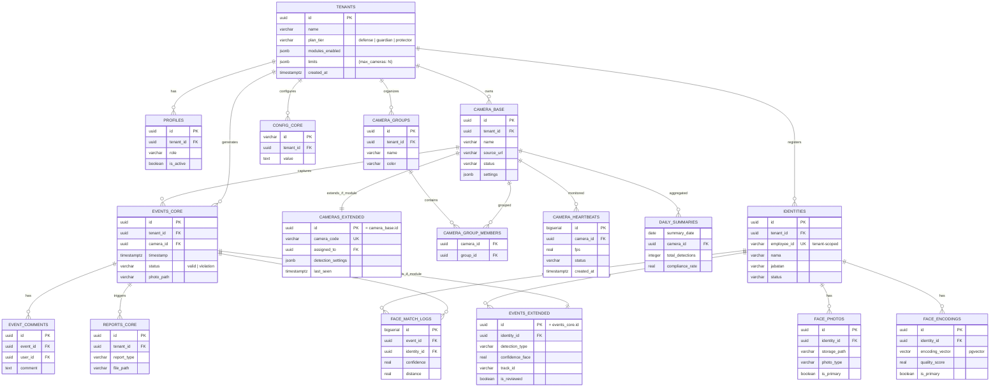

# 🗄️ ERD Supabase — CCTV-SOP SaaS (Modular Tier-Based)

> **Architecture**: Modular SaaS — Core + Optional Add-ons  
> **Plan Tiers**: `defense` (basic) → `guardian` → `protector` (full)  
> **Optional Modules**: Multi-Camera, Face Recognition  
> **Platform**: Supabase (PostgreSQL 15+)

---

## 📐 Tier-Based Module Matrix

| Feature                | Defense (Basic) | Guardian (Mid) | Protector (Full) |
| ---------------------- | --------------- | -------------- | ---------------- |
| **Auth & Users**       | ✅              | ✅             | ✅               |
| **Single Camera**      | ✅ 1 camera     | ✅ 1 camera    | ✅ 1 camera      |
| **Events & Reports**   | ✅ Basic        | ✅ + Export    | ✅ + Analytics   |
| **Multi-Camera**       | ❌              | ✅ Up to 4     | ✅ Unlimited     |
| **Camera Groups**      | ❌              | ✅             | ✅               |
| **Face Recognition**   | ❌              | ❌             | ✅               |
| **Advanced Analytics** | ❌              | ✅             | ✅               |
| **API Access**         | ❌              | ✅             | ✅               |

---

## 📊 Modular Architecture Diagram



---

## 🔧 Database Schema

### 1️⃣ CORE MODULE (Semua Plan)

```sql
-- ============================================
-- TENANTS (Plan & Feature Management)
-- ============================================
CREATE TABLE tenants (
    id UUID PRIMARY KEY DEFAULT uuid_generate_v4(),
    name VARCHAR(100) NOT NULL,
    slug VARCHAR(50) UNIQUE NOT NULL, -- URL-friendly name

    -- Plan & Billing
    plan_tier VARCHAR(20) NOT NULL DEFAULT 'defense'
        CHECK (plan_tier IN ('defense', 'guardian', 'protector')),
    plan_expires_at TIMESTAMPTZ, -- NULL = never expires

    -- Feature Flags (explicit module enablement)
    modules_enabled JSONB DEFAULT '{
        "multi_camera": false,
        "camera_groups": false,
        "heartbeats": false,
        "face_recognition": false,
        "analytics": false,
        "api_access": false
    }',

    -- Resource Limits (enforced di application layer)
    limits JSONB DEFAULT '{
        "max_cameras": 1,
        "max_identities": 0,
        "max_storage_gb": 5,
        "data_retention_days": 30,
        "max_users": 3
    }',

    -- Settings
    timezone VARCHAR(50) DEFAULT 'Asia/Jakarta',
    language VARCHAR(10) DEFAULT 'id',

    -- Status
    is_active BOOLEAN DEFAULT true,
    is_suspended BOOLEAN DEFAULT false,
    suspended_reason TEXT,

    created_at TIMESTAMPTZ DEFAULT NOW(),
    updated_at TIMESTAMPTZ DEFAULT NOW()
);

-- Helper function to check module availability
CREATE OR REPLACE FUNCTION is_module_enabled(p_tenant_id UUID, p_module TEXT)
RETURNS BOOLEAN AS $$
DECLARE
    v_enabled BOOLEAN;
BEGIN
    SELECT (modules_enabled->>p_module)::BOOLEAN INTO v_enabled
    FROM tenants
    WHERE id = p_tenant_id;
    RETURN COALESCE(v_enabled, false);
END;
$$ LANGUAGE plpgsql SECURITY DEFINER;

-- Helper function to get tenant limits
CREATE OR REPLACE FUNCTION get_tenant_limit(p_tenant_id UUID, p_limit TEXT)
RETURNS INTEGER AS $$
DECLARE
    v_limit INTEGER;
BEGIN
    SELECT (limits->>p_limit)::INTEGER INTO v_limit
    FROM tenants
    WHERE id = p_tenant_id;
    RETURN COALESCE(v_limit, 0);
END;
$$ LANGUAGE plpgsql SECURITY DEFINER;

-- Trigger: Update module flags when plan changes
CREATE OR REPLACE FUNCTION update_modules_on_plan_change()
RETURNS TRIGGER AS $$
BEGIN
    IF NEW.plan_tier != OLD.plan_tier THEN
        NEW.modules_enabled = CASE NEW.plan_tier
            WHEN 'defense' THEN '{
                "multi_camera": false,
                "camera_groups": false,
                "heartbeats": false,
                "face_recognition": false,
                "analytics": false,
                "api_access": false
            }'::JSONB
            WHEN 'guardian' THEN '{
                "multi_camera": true,
                "camera_groups": true,
                "heartbeats": true,
                "face_recognition": false,
                "analytics": true,
                "api_access": true
            }'::JSONB
            WHEN 'protector' THEN '{
                "multi_camera": true,
                "camera_groups": true,
                "heartbeats": true,
                "face_recognition": true,
                "analytics": true,
                "api_access": true
            }'::JSONB
        END;

        NEW.limits = CASE NEW.plan_tier
            WHEN 'defense' THEN '{
                "max_cameras": 1,
                "max_identities": 0,
                "max_storage_gb": 5,
                "data_retention_days": 30,
                "max_users": 3
            }'::JSONB
            WHEN 'guardian' THEN '{
                "max_cameras": 4,
                "max_identities": 0,
                "max_storage_gb": 20,
                "data_retention_days": 90,
                "max_users": 10
            }'::JSONB
            WHEN 'protector' THEN '{
                "max_cameras": 50,
                "max_identities": 500,
                "max_storage_gb": 100,
                "data_retention_days": 365,
                "max_users": 50
            }'::JSONB
        END;
    END IF;
    RETURN NEW;
END;
$$ LANGUAGE plpgsql;

CREATE TRIGGER trigger_update_modules_on_plan
    BEFORE UPDATE ON tenants
    FOR EACH ROW EXECUTE FUNCTION update_modules_on_plan_change();

-- ============================================
-- PROFILES (Users within a tenant)
-- ============================================
CREATE TABLE profiles (
    id UUID PRIMARY KEY REFERENCES auth.users(id) ON DELETE CASCADE,
    tenant_id UUID NOT NULL REFERENCES tenants(id) ON DELETE CASCADE,
    username VARCHAR(50) NOT NULL,
    name VARCHAR(100) NOT NULL,
    email VARCHAR(100),
    phone VARCHAR(20),
    role VARCHAR(20) NOT NULL CHECK (role IN ('superadmin', 'admin', 'viewer', 'operator')),
    role_label VARCHAR(50),
    is_active BOOLEAN DEFAULT true,
    last_login TIMESTAMPTZ,
    created_at TIMESTAMPTZ DEFAULT NOW(),
    updated_at TIMESTAMPTZ DEFAULT NOW(),

    UNIQUE(tenant_id, username)
);

-- ============================================
-- CAMERAS (Base - All Plans)
-- ============================================
CREATE TABLE cameras (
    id UUID PRIMARY KEY DEFAULT uuid_generate_v4(),
    tenant_id UUID NOT NULL REFERENCES tenants(id) ON DELETE CASCADE,

    -- Basic Info (All plans)
    name VARCHAR(100) NOT NULL,
    location VARCHAR(100) NOT NULL,
    source_url TEXT NOT NULL,
    stream_protocol VARCHAR(20) DEFAULT 'rtsp',

    -- Status (All plans)
    status VARCHAR(20) DEFAULT 'offline',
    detection_state VARCHAR(20) DEFAULT 'inactive',
    is_enabled BOOLEAN DEFAULT true,

    -- Basic Settings (All plans)
    settings JSONB DEFAULT '{
        "conf_person": 0.65,
        "conf_sop": 0.70,
        "cooldown_minutes": 5
    }',

    created_at TIMESTAMPTZ DEFAULT NOW(),
    updated_at TIMESTAMPTZ DEFAULT NOW()
);

-- ============================================
-- EVENTS (Base - All Plans)
-- ============================================
CREATE TABLE events (
    id UUID PRIMARY KEY DEFAULT uuid_generate_v4(),
    tenant_id UUID NOT NULL REFERENCES tenants(id) ON DELETE CASCADE,
    camera_id UUID NOT NULL REFERENCES cameras(id) ON DELETE CASCADE,

    -- Core event data
    timestamp TIMESTAMPTZ DEFAULT NOW(),
    location VARCHAR(100) NOT NULL,
    status VARCHAR(20) NOT NULL CHECK (status IN ('valid', 'violation', 'pending')),
    violation_type VARCHAR(100),
    missing_sops JSONB,

    -- AI Results
    confidence_person REAL,
    confidence_sop REAL,
    ai_description TEXT,

    -- Media
    photo_path VARCHAR(255),

    -- Extension fields (populated by triggers if modules enabled)
    detection_type VARCHAR(30) DEFAULT 'sop_check', -- 'sop_check' | 'face_recognition' | 'both'
    identity_id UUID, -- Will be FK to identities if face_recognition module enabled
    confidence_face REAL,
    staff_name VARCHAR(100), -- Manual entry or face match fallback
    track_id VARCHAR(50),
    is_reviewed BOOLEAN DEFAULT false,
    reviewed_by UUID REFERENCES profiles(id),
    reviewed_at TIMESTAMPTZ,

    created_at TIMESTAMPTZ DEFAULT NOW()
) PARTITION BY RANGE (timestamp);

-- Initial partition
CREATE TABLE events_y2026m03 PARTITION OF events
    FOR VALUES FROM ('2026-03-01') TO ('2026-04-01');

-- Indexes
CREATE INDEX idx_events_tenant ON events(tenant_id, timestamp DESC);
CREATE INDEX idx_events_camera ON events(camera_id, timestamp DESC);
CREATE INDEX idx_events_status ON events(status);

-- ============================================
-- CONFIG (Per-tenant settings)
-- ============================================
CREATE TABLE config (
    id VARCHAR(100) PRIMARY KEY,
    tenant_id UUID NOT NULL REFERENCES tenants(id) ON DELETE CASCADE,
    category VARCHAR(30) NOT NULL,
    value TEXT NOT NULL,
    is_sensitive BOOLEAN DEFAULT false,
    updated_at TIMESTAMPTZ DEFAULT NOW(),
    updated_by UUID REFERENCES profiles(id),

    UNIQUE(tenant_id, id)
);
```

### 2️⃣ MULTI-CAMERA MODULE (Guardian+)

```sql
-- ============================================
-- CAMERAS_EXTENDED (Guardian+ only)
-- ============================================
CREATE TABLE cameras_extended (
    camera_id UUID PRIMARY KEY REFERENCES cameras(id) ON DELETE CASCADE,
    tenant_id UUID NOT NULL REFERENCES tenants(id) ON DELETE CASCADE,

    -- Extended fields
    camera_code VARCHAR(20) UNIQUE, -- CAM001, CAM002, etc
    description TEXT,
    rotation INTEGER DEFAULT 0,
    resolution JSONB DEFAULT '{"width": 1920, "height": 1080}',
    fps_limit INTEGER DEFAULT 30,
    assigned_to UUID REFERENCES profiles(id),

    -- Advanced settings (overrides base settings)
    detection_settings JSONB DEFAULT '{
        "conf_person": 0.5,
        "conf_sop": 0.25,
        "cooldown_minutes": 10,
        "skip_frames": 0,
        "roi": null
    }',

    -- Health monitoring
    last_seen TIMESTAMPTZ,

    created_at TIMESTAMPTZ DEFAULT NOW(),
    updated_at TIMESTAMPTZ DEFAULT NOW()
);

-- Trigger: Only allow insert if multi_camera module enabled
CREATE OR REPLACE FUNCTION check_multi_camera_module()
RETURNS TRIGGER AS $$
BEGIN
    IF NOT is_module_enabled(NEW.tenant_id, 'multi_camera') THEN
        RAISE EXCEPTION 'Multi-camera module not enabled for this tenant';
    END IF;
    RETURN NEW;
END;
$$ LANGUAGE plpgsql;

CREATE TRIGGER trigger_check_multi_camera
    BEFORE INSERT ON cameras_extended
    FOR EACH ROW EXECUTE FUNCTION check_multi_camera_module();

-- ============================================
-- CAMERA_GROUPS (Guardian+)
-- ============================================
CREATE TABLE camera_groups (
    id UUID PRIMARY KEY DEFAULT uuid_generate_v4(),
    tenant_id UUID NOT NULL REFERENCES tenants(id) ON DELETE CASCADE,
    name VARCHAR(100) NOT NULL,
    description TEXT,
    color VARCHAR(7) DEFAULT '#38bdf8',
    created_at TIMESTAMPTZ DEFAULT NOW()
);

CREATE TABLE camera_group_members (
    camera_id UUID REFERENCES cameras(id) ON DELETE CASCADE,
    group_id UUID REFERENCES camera_groups(id) ON DELETE CASCADE,
    added_at TIMESTAMPTZ DEFAULT NOW(),
    PRIMARY KEY (camera_id, group_id)
);

-- Trigger: Check module
CREATE TRIGGER trigger_check_groups_module
    BEFORE INSERT ON camera_groups
    FOR EACH ROW EXECUTE FUNCTION check_multi_camera_module();

-- ============================================
-- CAMERA_HEARTBEATS (Guardian+)
-- ============================================
CREATE TABLE camera_heartbeats (
    id BIGSERIAL PRIMARY KEY,
    tenant_id UUID NOT NULL REFERENCES tenants(id) ON DELETE CASCADE,
    camera_id UUID NOT NULL REFERENCES cameras(id) ON DELETE CASCADE,
    status VARCHAR(20) NOT NULL,
    fps REAL,
    cpu_usage REAL,
    memory_usage REAL,
    active_tracks INTEGER DEFAULT 0,
    error_message TEXT,
    metadata JSONB,
    created_at TIMESTAMPTZ DEFAULT NOW()
);

CREATE INDEX idx_heartbeats_camera ON camera_heartbeats(camera_id, created_at DESC);

-- View: Latest heartbeat per camera (only if heartbeats module enabled)
CREATE VIEW camera_health_status AS
SELECT DISTINCT ON (h.camera_id)
    h.camera_id,
    c.tenant_id,
    h.status,
    h.fps,
    h.active_tracks,
    h.created_at as last_heartbeat,
    CASE
        WHEN h.created_at < NOW() - INTERVAL '5 minutes' THEN 'stale'
        ELSE 'fresh'
    END as data_freshness
FROM camera_heartbeats h
JOIN cameras c ON h.camera_id = c.id
WHERE is_module_enabled(c.tenant_id, 'heartbeats')
ORDER BY h.camera_id, h.created_at DESC;

-- ============================================
-- DAILY_SUMMARIES (Guardian+)
-- ============================================
CREATE TABLE daily_summaries (
    summary_date DATE NOT NULL,
    tenant_id UUID NOT NULL REFERENCES tenants(id) ON DELETE CASCADE,
    camera_id UUID REFERENCES cameras(id) ON DELETE CASCADE,

    total_detections INTEGER DEFAULT 0,
    total_violations INTEGER DEFAULT 0,
    total_valid INTEGER DEFAULT 0,
    unique_persons_detected INTEGER DEFAULT 0,
    compliance_rate REAL,
    breakdown_by_hour JSONB DEFAULT '{}',
    breakdown_by_violation_type JSONB DEFAULT '{}',

    created_at TIMESTAMPTZ DEFAULT NOW(),
    updated_at TIMESTAMPTZ DEFAULT NOW(),

    PRIMARY KEY (summary_date, tenant_id, camera_id)
);
```

### 3️⃣ FACE RECOGNITION MODULE (Protector Only)

```sql
-- ============================================
-- IDENTITIES (Protector only)
-- ============================================
CREATE TABLE identities (
    id UUID PRIMARY KEY DEFAULT uuid_generate_v4(),
    tenant_id UUID NOT NULL REFERENCES tenants(id) ON DELETE CASCADE,

    employee_id VARCHAR(20) NOT NULL,
    nama VARCHAR(100) NOT NULL,
    jabatan VARCHAR(50) NOT NULL,
    department VARCHAR(50),
    email VARCHAR(100),
    phone VARCHAR(20),
    join_date DATE,
    status VARCHAR(20) DEFAULT 'active',

    created_at TIMESTAMPTZ DEFAULT NOW(),
    updated_at TIMESTAMPTZ DEFAULT NOW(),

    UNIQUE(tenant_id, employee_id) -- Scoped to tenant
);

-- Trigger: Check face_recognition module
CREATE OR REPLACE FUNCTION check_face_recognition_module()
RETURNS TRIGGER AS $$
BEGIN
    IF NOT is_module_enabled(NEW.tenant_id, 'face_recognition') THEN
        RAISE EXCEPTION 'Face recognition module not enabled for this tenant';
    END IF;
    RETURN NEW;
END;
$$ LANGUAGE plpgsql;

CREATE TRIGGER trigger_check_face_recognition
    BEFORE INSERT ON identities
    FOR EACH ROW EXECUTE FUNCTION check_face_recognition_module();

-- Full-text search
ALTER TABLE identities ADD COLUMN search_vector tsvector
    GENERATED ALWAYS AS (to_tsvector('indonesian', nama || ' ' || COALESCE(jabatan, '') || ' ' || COALESCE(employee_id, ''))) STORED;
CREATE INDEX idx_identities_search ON identities USING GIN(search_vector);

-- ============================================
-- FACE_PHOTOS (Protector)
-- ============================================
CREATE TABLE face_photos (
    id UUID PRIMARY KEY DEFAULT uuid_generate_v4(),
    tenant_id UUID NOT NULL REFERENCES tenants(id) ON DELETE CASCADE,
    identity_id UUID NOT NULL REFERENCES identities(id) ON DELETE CASCADE,
    storage_path VARCHAR(255) NOT NULL,
    photo_type VARCHAR(20) DEFAULT 'front',
    is_primary BOOLEAN DEFAULT false,
    quality_score REAL,
    metadata JSONB,
    uploaded_at TIMESTAMPTZ DEFAULT NOW()
);

CREATE INDEX idx_face_photos_identity ON face_photos(identity_id);

-- ============================================
-- FACE_ENCODINGS (Protector + pgvector)
-- ============================================
CREATE TABLE face_encodings (
    id UUID PRIMARY KEY DEFAULT uuid_generate_v4(),
    tenant_id UUID NOT NULL REFERENCES tenants(id) ON DELETE CASCADE,
    identity_id UUID NOT NULL REFERENCES identities(id) ON DELETE CASCADE,
    face_photo_id UUID REFERENCES face_photos(id) ON DELETE SET NULL,

    encoding_type VARCHAR(20) DEFAULT '512d',
    encoding_vector VECTOR(512), -- pgvector
    quality_score REAL,
    is_primary BOOLEAN DEFAULT false,
    landmarks JSONB,

    created_at TIMESTAMPTZ DEFAULT NOW()
);

CREATE INDEX idx_face_encodings_identity ON face_encodings(identity_id);
CREATE INDEX idx_face_encodings_vector ON face_encodings
    USING hnsw (encoding_vector vector_cosine_ops);

-- ============================================
-- FACE_MATCH_LOGS (Protector)
-- ============================================
CREATE TABLE face_match_logs (
    id BIGSERIAL PRIMARY KEY,
    tenant_id UUID NOT NULL REFERENCES tenants(id) ON DELETE CASCADE,
    event_id UUID NOT NULL REFERENCES events(id) ON DELETE CASCADE,
    identity_id UUID REFERENCES identities(id),

    confidence REAL NOT NULL,
    distance REAL NOT NULL,
    match_status VARCHAR(20),
    candidates JSONB, -- Top-N candidates

    created_at TIMESTAMPTZ DEFAULT NOW()
);

CREATE INDEX idx_face_match_event ON face_match_logs(event_id);
CREATE INDEX idx_face_match_identity ON face_match_logs(identity_id);

-- ============================================
-- EVENT EXTENSIONS (via trigger - Protector)
-- ============================================

-- Function to validate face recognition fields
CREATE OR REPLACE FUNCTION validate_face_fields()
RETURNS TRIGGER AS $$
BEGIN
    -- If identity_id or confidence_face is set, check module
    IF (NEW.identity_id IS NOT NULL OR NEW.confidence_face IS NOT NULL) THEN
        IF NOT is_module_enabled(NEW.tenant_id, 'face_recognition') THEN
            RAISE EXCEPTION 'Face recognition fields require face_recognition module';
        END IF;
    END IF;
    RETURN NEW;
END;
$$ LANGUAGE plpgsql;

CREATE TRIGGER trigger_validate_face_fields
    BEFORE INSERT OR UPDATE ON events
    FOR EACH ROW EXECUTE FUNCTION validate_face_fields();
```

---

## 🔒 RLS Policies (Tenant Isolation)

```sql
-- Enable RLS
ALTER TABLE tenants ENABLE ROW LEVEL SECURITY;
ALTER TABLE profiles ENABLE ROW LEVEL SECURITY;
ALTER TABLE cameras ENABLE ROW LEVEL SECURITY;
ALTER TABLE events ENABLE ROW LEVEL SECURITY;
ALTER TABLE camera_groups ENABLE ROW LEVEL SECURITY;
ALTER TABLE identities ENABLE ROW LEVEL SECURITY;
ALTER TABLE face_photos ENABLE ROW LEVEL SECURITY;
ALTER TABLE face_encodings ENABLE ROW LEVEL SECURITY;

-- ============================================
-- TENANT ISOLATION POLICY
-- ============================================

-- Profiles: Users can only see their own tenant
CREATE POLICY "Tenant isolation - profiles" ON profiles
    FOR ALL USING (tenant_id = current_setting('app.current_tenant_id')::UUID);

-- Cameras: Tenant-scoped
CREATE POLICY "Tenant isolation - cameras" ON cameras
    FOR ALL USING (tenant_id = current_setting('app.current_tenant_id')::UUID);

-- Events: Tenant-scoped
CREATE POLICY "Tenant isolation - events" ON events
    FOR ALL USING (tenant_id = current_setting('app.current_tenant_id')::UUID);

-- Camera Groups: Tenant-scoped
CREATE POLICY "Tenant isolation - camera_groups" ON camera_groups
    FOR ALL USING (tenant_id = current_setting('app.current_tenant_id')::UUID);

-- Identities: Tenant-scoped
CREATE POLICY "Tenant isolation - identities" ON identities
    FOR ALL USING (tenant_id = current_setting('app.current_tenant_id')::UUID);

-- Face photos: Tenant-scoped
CREATE POLICY "Tenant isolation - face_photos" ON face_photos
    FOR ALL USING (tenant_id = current_setting('app.current_tenant_id')::UUID);

-- Face encodings: Tenant-scoped
CREATE POLICY "Tenant isolation - face_encodings" ON face_encodings
    FOR ALL USING (tenant_id = current_setting('app.current_tenant_id')::UUID);

-- ============================================
-- ROLE-BASED POLICIES
-- ============================================

-- Viewer: Read-only
CREATE POLICY "Viewer read-only - cameras" ON cameras
    FOR SELECT USING (
        tenant_id = current_setting('app.current_tenant_id')::UUID
        AND EXISTS (
            SELECT 1 FROM profiles
            WHERE id = auth.uid()
            AND role IN ('viewer', 'operator', 'admin', 'superadmin')
        )
    );

-- Admin: Can manage (except delete tenant)
CREATE POLICY "Admin manage - cameras" ON cameras
    FOR ALL USING (
        tenant_id = current_setting('app.current_tenant_id')::UUID
        AND EXISTS (
            SELECT 1 FROM profiles
            WHERE id = auth.uid()
            AND role IN ('admin', 'superadmin')
        )
    );

-- Superadmin: Full access
CREATE POLICY "Superadmin full - cameras" ON cameras
    FOR ALL USING (
        EXISTS (
            SELECT 1 FROM profiles
            WHERE id = auth.uid()
            AND role = 'superadmin'
        )
    );

-- ============================================
-- MODULE-BASED RESTRICTIONS
-- ============================================

-- Function to get user's tenant module status
CREATE OR REPLACE FUNCTION current_tenant_has_module(module_name TEXT)
RETURNS BOOLEAN AS $$
DECLARE
    v_tenant_id UUID;
    v_enabled BOOLEAN;
BEGIN
    -- Get tenant from current user
    SELECT tenant_id INTO v_tenant_id
    FROM profiles WHERE id = auth.uid();

    RETURN is_module_enabled(v_tenant_id, module_name);
END;
$$ LANGUAGE plpgsql SECURITY DEFINER;

-- Only allow camera insert if within limit
CREATE OR REPLACE FUNCTION check_camera_limit()
RETURNS TRIGGER AS $$
DECLARE
    v_current_count INTEGER;
    v_max_cameras INTEGER;
BEGIN
    SELECT COUNT(*) INTO v_current_count
    FROM cameras WHERE tenant_id = NEW.tenant_id;

    SELECT (limits->>'max_cameras')::INTEGER INTO v_max_cameras
    FROM tenants WHERE id = NEW.tenant_id;

    IF v_current_count >= v_max_cameras THEN
        RAISE EXCEPTION 'Camera limit reached for this tenant: %', v_max_cameras;
    END IF;

    RETURN NEW;
END;
$$ LANGUAGE plpgsql;

CREATE TRIGGER trigger_check_camera_limit
    BEFORE INSERT ON cameras
    FOR EACH ROW EXECUTE FUNCTION check_camera_limit();
```

---

## 📊 API Usage Examples

```typescript
// Set tenant context (call this after auth)
await supabase.rpc("set_tenant_context", {
  tenant_id: "tenant-uuid-here",
});

// Check if user can add more cameras
const { data: canAdd } = await supabase.rpc("can_add_camera", {
  p_tenant_id: tenantId,
});

// Get cameras with tenant isolation (automatic via RLS)
const { data: cameras } = await supabase.from("cameras").select("*"); // Automatically filtered by tenant

// Try to access identities (will fail if not protector plan)
try {
  const { data: identities } = await supabase.from("identities").select("*");
} catch (error) {
  // Error: Face recognition module not enabled
}

// Admin: Upgrade tenant plan
const { data } = await supabase
  .from("tenants")
  .update({
    plan_tier: "protector",
    modules_enabled: {
      multi_camera: true,
      camera_groups: true,
      heartbeats: true,
      face_recognition: true,
      analytics: true,
      api_access: true,
    },
  })
  .eq("id", tenantId);
```

---

## 📋 Migration Strategy

### Defense → Guardian

```sql
-- Upgrade tenant
UPDATE tenants
SET plan_tier = 'guardian'
WHERE id = 'tenant-uuid';

-- Auto-enabled via trigger:
-- - multi_camera: true
-- - camera_groups: true
-- - heartbeats: true
-- - max_cameras: 4
```

### Guardian → Protector

```sql
-- Upgrade tenant
UPDATE tenants
SET plan_tier = 'protector'
WHERE id = 'tenant-uuid';

-- Auto-enabled via trigger:
-- - face_recognition: true
-- - max_cameras: 50
-- - max_identities: 500
```

---

**Architecture**: Modular SaaS with Tier-Based Feature Flags  
**Platform**: Supabase  
**Plans**: defense → guardian → protector  
**Created**: 2026-03-12  
**Status**: Production Ready
