# 🗄️ ERD v2 — CCTV-SOP Dashboard (Modular Multi-Camera + Face Recognition)

> **Version:** 2.0  
> **Focus:** Modular architecture for multi-camera support + extensible face recognition  
> **Compatibility:** PostgreSQL (recommended) / MySQL / SQLite

---

## 📐 Entity Relationship Diagram (Mermaid)

```mermaid
erDiagram
    %% ============ CORE AUTH MODULE ============
    USERS {
        uuid id PK
        varchar username UK "Unique, untuk login"
        varchar password_hash "Hashed (bcrypt/argon2)"
        varchar email UK "Nullable, untuk notifikasi"
        varchar name "Nama tampilan"
        varchar phone "Nullable"
        varchar role "superadmin | admin | viewer"
        varchar role_label "Label UI"
        boolean is_active "Default: true"
        timestamp last_login "Nullable"
        timestamp created_at "Auto-generated"
        timestamp updated_at "Auto-generated"
    }

    USER_SESSIONS {
        uuid id PK
        uuid user_id FK
        varchar token "JWT refresh token hash"
        varchar ip_address "Nullable"
        varchar user_agent "Nullable"
        timestamp expires_at
        timestamp created_at
    }

    AUDIT_LOGS {
        serial id PK
        uuid user_id FK "Nullable (system actions)"
        varchar action "login | logout | config_change | delete"
        varchar entity_type "users | cameras | identities | events"
        varchar entity_id "Target record ID"
        jsonb old_values "Previous state"
        jsonb new_values "New state"
        varchar ip_address
        timestamp created_at
    }

    %% ============ CAMERA MODULE ============
    CAMERAS {
        uuid id PK
        varchar camera_code UK "CAM001, CAM002, etc"
        varchar name "CCTV Produksi A"
        varchar location "Area / gedung / lantai"
        text description "Nullable"
        varchar source_url "RTSP URL atau device index"
        varchar stream_protocol "rtsp | http | file"
        integer rotation "0 | 90 | 180 | 270"
        jsonb resolution "{width: 1920, height: 1080}"
        integer fps_limit "Max FPS, default 30"
        varchar status "online | offline | error | maintenance"
        varchar detection_state "active | idle | inactive | error"
        boolean is_enabled "Default: true"
        uuid assigned_to_user_id FK "Nullable - petugas area"
        timestamp last_seen "Last heartbeat"
        jsonb detection_settings "Per-camera override"
        timestamp created_at
        timestamp updated_at
    }

    CAMERA_GROUPS {
        uuid id PK
        varchar name "Gudang Utama"
        text description
        varchar color "Hex untuk UI (#38bdf8)"
        timestamp created_at
    }

    CAMERA_GROUP_MEMBERS {
        uuid camera_id FK
        uuid group_id FK
        timestamp added_at
    }

    CAMERA_HEARTBEATS {
        serial id PK
        uuid camera_id FK
        varchar status "healthy | warning | error"
        real fps "Current FPS"
        real cpu_usage "Nullable"
        real memory_usage "Nullable"
        integer active_tracks "Person being tracked"
        text error_message "Nullable"
        timestamp created_at
    }

    %% ============ FACE RECOGNITION MODULE ============
    IDENTITIES {
        uuid id PK
        varchar employee_id UK "EMP001, etc"
        varchar nama "Nama lengkap"
        varchar jabatan "Posisi / role"
        varchar department "Departemen"
        varchar email "Nullable"
        varchar phone "Nullable"
        date join_date "Tanggal masuk kerja"
        varchar avatar_path "Path foto wajah utama"
        varchar status "active | inactive | suspended"
        timestamp terdaftar
        timestamp updated_at
    }

    FACE_ENCODINGS {
        uuid id PK
        uuid identity_id FK
        varchar encoding_type "128d | 512d | custom"
        bytea encoding_vector "Binary face embedding"
        real quality_score "0.0-1.0, face clarity"
        varchar source_photo_path "Foto sumber encoding"
        boolean is_primary "Default: false - encoding utama"
        jsonb landmarks "Face landmarks data"
        timestamp created_at
    }

    FACE_PHOTOS {
        uuid id PK
        uuid identity_id FK
        varchar photo_path "Path file foto"
        varchar photo_type "front | left | right | with_glasses"
        boolean is_primary "Default: false"
        real quality_score "0.0-1.0"
        jsonb metadata "EXIF, lighting, etc"
        timestamp uploaded_at
    }

    FACE_MATCH_LOGS {
        serial id PK
        uuid event_id FK
        uuid identity_id FK "Matched identity"
        real confidence "Match confidence 0.0-1.0"
        real distance "Vector distance"
        varchar match_status "matched | rejected | uncertain"
        jsonb candidates "Top-N candidates with scores"
        timestamp created_at
    }

    %% ============ DETECTION EVENTS MODULE ============
    EVENTS {
        uuid id PK
        timestamp timestamp "Waktu deteksi"
        uuid camera_id FK "Source camera"
        varchar location "Denormalized - area name"

        %% Face recognition fields
        uuid identity_id FK "Nullable - jika face match"
        varchar staff_name "Fallback/manual entry"

        %% Detection fields
        varchar detection_type "sop_check | face_recognition | both"
        varchar status "valid | violation | pending_review"
        varchar violation_type "Nullable - jenis pelanggaran"
        jsonb missing_sops "['helm', 'masker', 'baju']"

        %% Confidence & AI data
        real confidence_person "0.0-1.0"
        real confidence_sop "0.0-1.0"
        real confidence_face "0.0-1.0, face match confidence"
        text ai_description "Analisis AI"
        jsonb ai_metadata "Raw AI output"

        %% Media
        varchar photo_path "Foto bukti"
        varchar video_clip_path "Nullable - 5s clip"

        %% Tracking
        varchar track_id "Engine tracking ID"
        integer track_duration_seconds "How long tracked"

        %% Review & approval
        boolean is_reviewed "Default: false"
        uuid reviewed_by FK "Nullable - user who reviewed"
        timestamp reviewed_at "Nullable"
        varchar review_notes "Nullable"

        timestamp created_at
        timestamp updated_at
    }

    EVENT_COMMENTS {
        uuid id PK
        uuid event_id FK
        uuid user_id FK
        text comment
        timestamp created_at
    }

    EVENT_TAGS {
        uuid id PK
        varchar name UK "critical | training | false_positive"
        varchar color "Hex color"
        varchar description
        timestamp created_at
    }

    EVENT_TAG_ASSIGNMENTS {
        uuid event_id FK
        uuid tag_id FK
        uuid assigned_by FK
        timestamp assigned_at
    }

    %% ============ REPORTS & ANALYTICS MODULE ============
    REPORTS {
        uuid id PK
        varchar report_type "daily | weekly | monthly | custom"
        varchar format "pdf | csv | xlsx"
        uuid generated_by FK
        jsonb filters "Date range, cameras, etc"
        varchar file_path "Generated file location"
        varchar status "generating | ready | expired"
        timestamp generated_at
        timestamp expires_at
    }

    DAILY_SUMMARIES {
        date summary_date PK
        uuid camera_id FK "Nullable - all cameras if null"
        integer total_detections
        integer total_violations
        integer total_valid
        real compliance_rate "0.0-100.0"
        jsonb breakdown_by_hour "{08: 12, 09: 15, ...}"
        jsonb breakdown_by_violation_type
        timestamp created_at
    }

    %% ============ CONFIGURATION MODULE ============
    CONFIG_CATEGORIES {
        varchar id PK "camera | detection | server | notification | ai"
        varchar name "Display name"
        varchar description
        varchar icon "UI icon name"
        integer display_order
    }

    CONFIG_SETTINGS {
        varchar id PK
        varchar category_id FK
        varchar key UK "Unique per category"
        varchar display_name "Human readable"
        text description "Help text"
        varchar data_type "string | integer | float | boolean | json"
        text value "Current value"
        text default_value
        text validation_rules "JSON schema or regex"
        boolean is_sensitive "Encrypt if true"
        boolean is_editable
        timestamp updated_at
        uuid updated_by FK
    }

    CAMERA_PRESETS {
        uuid id PK
        uuid camera_id FK
        varchar preset_name "Day Mode | Night Mode"
        jsonb detection_settings "Override settings"
        time schedule_start "Nullable - auto-apply"
        time schedule_end "Nullable - auto-apply"
        boolean is_active "Default: false"
        timestamp created_at
    }

    %% ============ NOTIFICATION MODULE ============
    NOTIFICATION_TEMPLATES {
        uuid id PK
        varchar name UK "violation_alert | daily_summary"
        varchar channel "telegram | email | webhook | push"
        varchar subject "For email"
        text template_body "With {{variables}}"
        boolean is_active
        timestamp created_at
    }

    NOTIFICATION_LOGS {
        uuid id PK
        uuid event_id FK "Nullable - linked event"
        varchar template_id
        varchar channel
        varchar recipient
        text message_content
        varchar status "sent | failed | pending"
        text error_message "Nullable"
        timestamp sent_at
    }

    %% ============ RELATIONSHIPS ============
    USERS ||--o{ USER_SESSIONS : "has"
    USERS ||--o{ AUDIT_LOGS : "performs"
    USERS ||--o{ EVENTS : "reviews"
    USERS ||--o{ EVENT_COMMENTS : "writes"
    USERS ||--o{ REPORTS : "generates"

    CAMERAS ||--o{ EVENTS : "captures"
    CAMERAS ||--o{ CAMERA_HEARTBEATS : "has"
    CAMERAS ||--o{ CAMERA_PRESETS : "has"
    CAMERAS ||--o{ DAILY_SUMMARIES : "generates"
    CAMERAS }o--|| CAMERA_GROUPS : "belongs_to"

    IDENTITIES ||--o{ FACE_ENCODINGS : "has"
    IDENTITIES ||--o{ FACE_PHOTOS : "has"
    IDENTITIES ||--o{ EVENTS : "detected_in"
    IDENTITIES ||--o{ FACE_MATCH_LOGS : "matched_in"

    EVENTS ||--o{ EVENT_COMMENTS : "has"
    EVENTS ||--o{ FACE_MATCH_LOGS : "has"
    EVENTS }o--o{ EVENT_TAGS : "tagged"
```



---

## 📊 Detailed Schema Definitions

### 🔐 MODULE: Authentication & Authorization

#### `users` — System Users

| Kolom           | Tipe         | Constraint       | Keterangan                          |
| --------------- | ------------ | ---------------- | ----------------------------------- |
| `id`            | UUID         | PK               | Generate dengan uuid_generate_v4()  |
| `username`      | VARCHAR(50)  | UNIQUE, NOT NULL | Login identifier                    |
| `password_hash` | VARCHAR(255) | NOT NULL         | **Argon2id** atau bcrypt cost ≥ 12  |
| `email`         | VARCHAR(100) | UNIQUE, NULLABLE | Untuk notifikasi & recovery         |
| `name`          | VARCHAR(100) | NOT NULL         | Nama tampilan                       |
| `phone`         | VARCHAR(20)  | NULLABLE         | Kontak darurat                      |
| `role`          | VARCHAR(20)  | NOT NULL         | `superadmin` \| `admin` \| `viewer` |
| `role_label`    | VARCHAR(50)  |                  | Label UI ("System Administrator")   |
| `is_active`     | BOOLEAN      | DEFAULT true     | Soft-delete flag                    |
| `last_login`    | TIMESTAMP    | NULLABLE         | Tracking aktivitas                  |
| `created_at`    | TIMESTAMP    | DEFAULT NOW()    |                                     |
| `updated_at`    | TIMESTAMP    | DEFAULT NOW()    | Auto-update on change               |

#### `user_sessions` — Active Login Sessions

| Kolom        | Tipe         | Constraint                       | Keterangan           |
| ------------ | ------------ | -------------------------------- | -------------------- |
| `id`         | UUID         | PK                               |                      |
| `user_id`    | UUID         | FK → users.id, ON DELETE CASCADE |                      |
| `token`      | VARCHAR(255) | NOT NULL                         | Refresh token hash   |
| `ip_address` | INET         | NULLABLE                         | PostgreSQL inet type |
| `user_agent` | TEXT         | NULLABLE                         | Browser/device info  |
| `expires_at` | TIMESTAMP    | NOT NULL                         | Session expiry       |
| `created_at` | TIMESTAMP    | DEFAULT NOW()                    |                      |

#### `audit_logs` — Activity Tracking (Compliance)

| Kolom         | Tipe         | Constraint              | Keterangan     |
| ------------- | ------------ | ----------------------- | -------------- |
| `id`          | BIGSERIAL    | PK                      |                |
| `user_id`     | UUID         | FK → users.id, NULLABLE | System = NULL  |
| `action`      | VARCHAR(50)  | NOT NULL                | Enum tipe aksi |
| `entity_type` | VARCHAR(50)  | NOT NULL                | Tabel target   |
| `entity_id`   | VARCHAR(100) | NOT NULL                | Record ID      |
| `old_values`  | JSONB        | NULLABLE                | Before state   |
| `new_values`  | JSONB        | NULLABLE                | After state    |
| `ip_address`  | INET         | NOT NULL                |                |
| `created_at`  | TIMESTAMP    | DEFAULT NOW()           |                |

---

### 📹 MODULE: Camera Management (Multi-Camera Support)

#### `cameras` — Camera Registry

| Kolom                 | Tipe         | Constraint              | Keterangan                                        |
| --------------------- | ------------ | ----------------------- | ------------------------------------------------- |
| `id`                  | UUID         | PK                      |                                                   |
| `camera_code`         | VARCHAR(20)  | UNIQUE, NOT NULL        | `CAM001`, `CAM002`                                |
| `name`                | VARCHAR(100) | NOT NULL                | Nama display                                      |
| `location`            | VARCHAR(100) | NOT NULL                | Area fisik                                        |
| `description`         | TEXT         | NULLABLE                | Catatan tambahan                                  |
| `source_url`          | VARCHAR(500) | NOT NULL                | RTSP/HTTP/device path                             |
| `stream_protocol`     | VARCHAR(20)  | DEFAULT 'rtsp'          | `rtsp` \| `http` \| `file`                        |
| `rotation`            | INTEGER      | DEFAULT 0               | `0` \| `90` \| `180` \| `270`                     |
| `resolution`          | JSONB        | NULLABLE                | `{"w":1920,"h":1080}`                             |
| `fps_limit`           | INTEGER      | DEFAULT 30              | Max processing FPS                                |
| `status`              | VARCHAR(20)  | DEFAULT 'offline'       | `online` \| `offline` \| `error` \| `maintenance` |
| `detection_state`     | VARCHAR(20)  | DEFAULT 'inactive'      | `active` \| `idle` \| `inactive` \| `error`       |
| `is_enabled`          | BOOLEAN      | DEFAULT true            | Aktif/non-aktif                                   |
| `assigned_to_user_id` | UUID         | FK → users.id, NULLABLE | PIC area                                          |
| `last_seen`           | TIMESTAMP    | NULLABLE                | Heartbeat terakhir                                |
| `detection_settings`  | JSONB        | NULLABLE                | Override global settings                          |
| `created_at`          | TIMESTAMP    | DEFAULT NOW()           |                                                   |
| `updated_at`          | TIMESTAMP    | DEFAULT NOW()           |                                                   |

**Example `detection_settings` JSONB:**

```json
{
  "conf_person": 0.5,
  "conf_sop": 0.25,
  "cooldown_minutes": 10,
  "roi": { "x": 100, "y": 100, "w": 800, "h": 600 },
  "skip_frames": 2
}
```

#### `camera_groups` — Logical Camera Grouping

| Kolom         | Tipe         | Constraint        | Keterangan     |
| ------------- | ------------ | ----------------- | -------------- |
| `id`          | UUID         | PK                |                |
| `name`        | VARCHAR(100) | NOT NULL          | "Gudang Utama" |
| `description` | TEXT         | NULLABLE          |                |
| `color`       | VARCHAR(7)   | DEFAULT '#38bdf8' | Hex untuk UI   |
| `created_at`  | TIMESTAMP    | DEFAULT NOW()     |                |

#### `camera_group_members` — Group Membership (Many-to-Many)

| Kolom       | Tipe      | Constraint                               | Keterangan |
| ----------- | --------- | ---------------------------------------- | ---------- |
| `camera_id` | UUID      | FK → cameras.id, ON DELETE CASCADE       |            |
| `group_id`  | UUID      | FK → camera_groups.id, ON DELETE CASCADE |            |
| `added_at`  | TIMESTAMP | DEFAULT NOW()                            |            |

**PK:** (`camera_id`, `group_id`)

#### `camera_heartbeats` — Health Monitoring

| Kolom           | Tipe        | Constraint                         | Keterangan                        |
| --------------- | ----------- | ---------------------------------- | --------------------------------- |
| `id`            | BIGSERIAL   | PK                                 |                                   |
| `camera_id`     | UUID        | FK → cameras.id, ON DELETE CASCADE |                                   |
| `status`        | VARCHAR(20) | NOT NULL                           | `healthy` \| `warning` \| `error` |
| `fps`           | REAL        | NULLABLE                           | FPS aktual                        |
| `cpu_usage`     | REAL        | NULLABLE                           | % CPU camera process              |
| `memory_usage`  | REAL        | NULLABLE                           | MB memory                         |
| `active_tracks` | INTEGER     | DEFAULT 0                          | Orang yang sedang di-track        |
| `error_message` | TEXT        | NULLABLE                           | Error detail                      |
| `created_at`    | TIMESTAMP   | DEFAULT NOW()                      |                                   |

---

### 🧑 MODULE: Face Recognition System

#### `identities` — Staff/Karyawan Registry

| Kolom         | Tipe         | Constraint       | Keterangan                            |
| ------------- | ------------ | ---------------- | ------------------------------------- |
| `id`          | UUID         | PK               |                                       |
| `employee_id` | VARCHAR(20)  | UNIQUE, NOT NULL | `EMP001` format                       |
| `nama`        | VARCHAR(100) | NOT NULL         | Nama lengkap                          |
| `jabatan`     | VARCHAR(50)  | NOT NULL         | Posisi                                |
| `department`  | VARCHAR(50)  | NULLABLE         | Departemen                            |
| `email`       | VARCHAR(100) | NULLABLE         |                                       |
| `phone`       | VARCHAR(20)  | NULLABLE         |                                       |
| `join_date`   | DATE         | NULLABLE         | Tanggal masuk                         |
| `avatar_path` | VARCHAR(255) | NULLABLE         | Foto utama                            |
| `status`      | VARCHAR(20)  | DEFAULT 'active' | `active` \| `inactive` \| `suspended` |
| `terdaftar`   | TIMESTAMP    | DEFAULT NOW()    |                                       |
| `updated_at`  | TIMESTAMP    | DEFAULT NOW()    |                                       |

#### `face_encodings` — Face Embedding Vectors

| Kolom               | Tipe         | Constraint                            | Keterangan                    |
| ------------------- | ------------ | ------------------------------------- | ----------------------------- |
| `id`                | UUID         | PK                                    |                               |
| `identity_id`       | UUID         | FK → identities.id, ON DELETE CASCADE |                               |
| `encoding_type`     | VARCHAR(20)  | DEFAULT '128d'                        | `128d` \| `512d` \| `custom`  |
| `encoding_vector`   | BYTEA        | NOT NULL                              | Binary float array            |
| `quality_score`     | REAL         | NULLABLE                              | 0.0-1.0 face clarity          |
| `source_photo_path` | VARCHAR(255) | NULLABLE                              | Foto sumber                   |
| `is_primary`        | BOOLEAN      | DEFAULT false                         | Encoding utama untuk matching |
| `landmarks`         | JSONB        | NULLABLE                              | Face landmark data            |
| `created_at`        | TIMESTAMP    | DEFAULT NOW()                         |                               |

**Notes:**

- Satu identity bisa punya **multiple encodings** (foto berbeda, sudut berbeda)
- `encoding_vector` disimpan sebagai binary untuk efisiensi storage & query
- Gunakan `pgvector` extension untuk similarity search (PostgreSQL)

#### `face_photos` — Reference Photos

| Kolom           | Tipe         | Constraint                            | Keterangan                                     |
| --------------- | ------------ | ------------------------------------- | ---------------------------------------------- |
| `id`            | UUID         | PK                                    |                                                |
| `identity_id`   | UUID         | FK → identities.id, ON DELETE CASCADE |                                                |
| `photo_path`    | VARCHAR(255) | NOT NULL                              | Path file                                      |
| `photo_type`    | VARCHAR(20)  | DEFAULT 'front'                       | `front` \| `left` \| `right` \| `with_glasses` |
| `is_primary`    | BOOLEAN      | DEFAULT false                         | Foto utama                                     |
| `quality_score` | REAL         | NULLABLE                              | 0.0-1.0                                        |
| `metadata`      | JSONB        | NULLABLE                              | EXIF, lighting, etc                            |
| `uploaded_at`   | TIMESTAMP    | DEFAULT NOW()                         |                                                |

#### `face_match_logs` — Recognition Results

| Kolom          | Tipe        | Constraint                        | Keterangan                                   |
| -------------- | ----------- | --------------------------------- | -------------------------------------------- |
| `id`           | BIGSERIAL   | PK                                |                                              |
| `event_id`     | UUID        | FK → events.id, ON DELETE CASCADE |                                              |
| `identity_id`  | UUID        | FK → identities.id                | Hasil match                                  |
| `confidence`   | REAL        | NOT NULL                          | 0.0-1.0 match confidence                     |
| `distance`     | REAL        | NOT NULL                          | Vector distance (lower = better)             |
| `match_status` | VARCHAR(20) | NOT NULL                          | `matched` \| `rejected` \| `uncertain`       |
| `candidates`   | JSONB       | NULLABLE                          | Top-N candidates: `[{id, name, confidence}]` |
| `created_at`   | TIMESTAMP   | DEFAULT NOW()                     |                                              |

---

### 📋 MODULE: Detection Events

#### `events` — Detection Records (Core Table)

| Kolom                    | Tipe         | Constraint                   | Keterangan                                  |
| ------------------------ | ------------ | ---------------------------- | ------------------------------------------- |
| `id`                     | UUID         | PK                           |                                             |
| `timestamp`              | TIMESTAMP    | NOT NULL, DEFAULT NOW()      | Waktu deteksi                               |
| `camera_id`              | UUID         | FK → cameras.id, NOT NULL    | Sumber                                      |
| `location`               | VARCHAR(100) | NOT NULL                     | Denormalized area name                      |
| `identity_id`            | UUID         | FK → identities.id, NULLABLE | Jika face match                             |
| `staff_name`             | VARCHAR(100) | NULLABLE                     | Fallback/manual                             |
| `detection_type`         | VARCHAR(30)  | NOT NULL                     | `sop_check` \| `face_recognition` \| `both` |
| `status`                 | VARCHAR(20)  | NOT NULL                     | `valid` \| `violation` \| `pending_review`  |
| `violation_type`         | VARCHAR(100) | NULLABLE                     | "Helm Tidak Dipakai"                        |
| `missing_sops`           | JSONB        | NULLABLE                     | `["helm","masker"]`                         |
| `confidence_person`      | REAL         | NULLABLE                     | 0.0-1.0 person detection                    |
| `confidence_sop`         | REAL         | NULLABLE                     | 0.0-1.0 SOP detection                       |
| `confidence_face`        | REAL         | NULLABLE                     | 0.0-1.0 face match                          |
| `ai_description`         | TEXT         | NULLABLE                     | Analisis AI                                 |
| `ai_metadata`            | JSONB        | NULLABLE                     | Raw output                                  |
| `photo_path`             | VARCHAR(255) | NULLABLE                     | Bukti foto                                  |
| `video_clip_path`        | VARCHAR(255) | NULLABLE                     | 5s clip                                     |
| `track_id`               | VARCHAR(50)  | NULLABLE                     | Engine tracking ID                          |
| `track_duration_seconds` | INTEGER      | NULLABLE                     | Durasi tracking                             |
| `is_reviewed`            | BOOLEAN      | DEFAULT false                | Sudah direview?                             |
| `reviewed_by`            | UUID         | FK → users.id, NULLABLE      |                                             |
| `reviewed_at`            | TIMESTAMP    | NULLABLE                     |                                             |
| `review_notes`           | TEXT         | NULLABLE                     |                                             |
| `created_at`             | TIMESTAMP    | DEFAULT NOW()                |                                             |
| `updated_at`             | TIMESTAMP    | DEFAULT NOW()                |                                             |

#### `event_comments` — Manual Notes

| Kolom        | Tipe      | Constraint                        | Keterangan |
| ------------ | --------- | --------------------------------- | ---------- |
| `id`         | UUID      | PK                                |            |
| `event_id`   | UUID      | FK → events.id, ON DELETE CASCADE |            |
| `user_id`    | UUID      | FK → users.id                     | Penulis    |
| `comment`    | TEXT      | NOT NULL                          |            |
| `created_at` | TIMESTAMP | DEFAULT NOW()                     |            |

#### `event_tags` — Categorization

| Kolom         | Tipe        | Constraint        | Keterangan                   |
| ------------- | ----------- | ----------------- | ---------------------------- |
| `id`          | UUID        | PK                |                              |
| `name`        | VARCHAR(50) | UNIQUE, NOT NULL  | `critical`, `false_positive` |
| `color`       | VARCHAR(7)  | DEFAULT '#f59e0b' | Hex                          |
| `description` | TEXT        | NULLABLE          |                              |
| `created_at`  | TIMESTAMP   | DEFAULT NOW()     |                              |

#### `event_tag_assignments` — Many-to-Many

| Kolom         | Tipe      | Constraint                            | Keterangan |
| ------------- | --------- | ------------------------------------- | ---------- |
| `event_id`    | UUID      | FK → events.id, ON DELETE CASCADE     |            |
| `tag_id`      | UUID      | FK → event_tags.id, ON DELETE CASCADE |            |
| `assigned_by` | UUID      | FK → users.id                         |            |
| `assigned_at` | TIMESTAMP | DEFAULT NOW()                         |            |

---

### ⚙️ MODULE: Configuration

#### `config_categories` — Setting Groups

| Kolom           | Tipe        | Constraint | Keterangan                       |
| --------------- | ----------- | ---------- | -------------------------------- |
| `id`            | VARCHAR(30) | PK         | `camera`, `detection`, `ai`, etc |
| `name`          | VARCHAR(50) | NOT NULL   | Display name                     |
| `description`   | TEXT        | NULLABLE   |                                  |
| `icon`          | VARCHAR(50) | NULLABLE   | UI icon                          |
| `display_order` | INTEGER     | DEFAULT 0  |                                  |

#### `config_settings` — Key-Value Settings

| Kolom              | Tipe         | Constraint                         | Keterangan                                              |
| ------------------ | ------------ | ---------------------------------- | ------------------------------------------------------- |
| `id`               | VARCHAR(100) | PK                                 | `camera.conf_person`                                    |
| `category_id`      | VARCHAR(30)  | FK → config_categories.id          |                                                         |
| `key`              | VARCHAR(50)  | NOT NULL, UNIQUE(category_id, key) |                                                         |
| `display_name`     | VARCHAR(100) | NOT NULL                           | Label UI                                                |
| `description`      | TEXT         | NULLABLE                           | Help text                                               |
| `data_type`        | VARCHAR(20)  | NOT NULL                           | `string` \| `integer` \| `float` \| `boolean` \| `json` |
| `value`            | TEXT         | NOT NULL                           | Current value                                           |
| `default_value`    | TEXT         | NOT NULL                           |                                                         |
| `validation_rules` | TEXT         | NULLABLE                           | JSON schema                                             |
| `is_sensitive`     | BOOLEAN      | DEFAULT false                      | Encrypt?                                                |
| `is_editable`      | BOOLEAN      | DEFAULT true                       |                                                         |
| `updated_at`       | TIMESTAMP    | DEFAULT NOW()                      |                                                         |
| `updated_by`       | UUID         | FK → users.id, NULLABLE            |                                                         |

#### `camera_presets` — Per-Camera Config Profiles

| Kolom                | Tipe        | Constraint                         | Keterangan               |
| -------------------- | ----------- | ---------------------------------- | ------------------------ |
| `id`                 | UUID        | PK                                 |                          |
| `camera_id`          | UUID        | FK → cameras.id, ON DELETE CASCADE |                          |
| `preset_name`        | VARCHAR(50) | NOT NULL                           | "Day Mode", "Night Mode" |
| `detection_settings` | JSONB       | NOT NULL                           | Override config          |
| `schedule_start`     | TIME        | NULLABLE                           | Auto-apply start         |
| `schedule_end`       | TIME        | NULLABLE                           | Auto-apply end           |
| `is_active`          | BOOLEAN     | DEFAULT false                      |                          |
| `created_at`         | TIMESTAMP   | DEFAULT NOW()                      |                          |

---

### 📊 MODULE: Reports & Analytics

#### `reports` — Generated Report Files

| Kolom          | Tipe         | Constraint           | Keterangan                                   |
| -------------- | ------------ | -------------------- | -------------------------------------------- |
| `id`           | UUID         | PK                   |                                              |
| `report_type`  | VARCHAR(20)  | NOT NULL             | `daily` \| `weekly` \| `monthly` \| `custom` |
| `format`       | VARCHAR(10)  | NOT NULL             | `pdf` \| `csv` \| `xlsx`                     |
| `generated_by` | UUID         | FK → users.id        |                                              |
| `filters`      | JSONB        | NOT NULL             | Date range, cameras, etc                     |
| `file_path`    | VARCHAR(255) | NOT NULL             |                                              |
| `status`       | VARCHAR(20)  | DEFAULT 'generating' | `generating` \| `ready` \| `expired`         |
| `generated_at` | TIMESTAMP    | DEFAULT NOW()        |                                              |
| `expires_at`   | TIMESTAMP    | NOT NULL             | Auto-cleanup                                 |

#### `daily_summaries` — Pre-aggregated Stats

| Kolom                         | Tipe      | Constraint          | Keterangan             |
| ----------------------------- | --------- | ------------------- | ---------------------- |
| `summary_date`                | DATE      | PK                  |                        |
| `camera_id`                   | UUID      | FK → cameras.id, PK | NULL = all cameras     |
| `total_detections`            | INTEGER   | DEFAULT 0           |                        |
| `total_violations`            | INTEGER   | DEFAULT 0           |                        |
| `total_valid`                 | INTEGER   | DEFAULT 0           |                        |
| `compliance_rate`             | REAL      | NULLABLE            | 0.0-100.0              |
| `breakdown_by_hour`           | JSONB     | NULLABLE            | `{"08": 12, "09": 15}` |
| `breakdown_by_violation_type` | JSONB     | NULLABLE            | Aggregation            |
| `created_at`                  | TIMESTAMP | DEFAULT NOW()       |                        |

---

### 🔔 MODULE: Notifications

#### `notification_templates` — Message Templates

| Kolom           | Tipe         | Constraint       | Keterangan                         |
| --------------- | ------------ | ---------------- | ---------------------------------- |
| `id`            | UUID         | PK               |                                    |
| `name`          | VARCHAR(50)  | UNIQUE, NOT NULL | `violation_alert`                  |
| `channel`       | VARCHAR(20)  | NOT NULL         | `telegram` \| `email` \| `webhook` |
| `subject`       | VARCHAR(200) | NULLABLE         | Untuk email                        |
| `template_body` | TEXT         | NOT NULL         | Dengan `{{variables}}`             |
| `is_active`     | BOOLEAN      | DEFAULT true     |                                    |
| `created_at`    | TIMESTAMP    | DEFAULT NOW()    |                                    |

#### `notification_logs` — Delivery History

| Kolom             | Tipe         | Constraint                     | Keterangan                      |
| ----------------- | ------------ | ------------------------------ | ------------------------------- |
| `id`              | UUID         | PK                             |                                 |
| `event_id`        | UUID         | FK → events.id, NULLABLE       | Linked event                    |
| `template_id`     | UUID         | FK → notification_templates.id |                                 |
| `channel`         | VARCHAR(20)  | NOT NULL                       |                                 |
| `recipient`       | VARCHAR(255) | NOT NULL                       | Chat ID / email                 |
| `message_content` | TEXT         | NOT NULL                       | Rendered message                |
| `status`          | VARCHAR(20)  | NOT NULL                       | `sent` \| `failed` \| `pending` |
| `error_message`   | TEXT         | NULLABLE                       |                                 |
| `sent_at`         | TIMESTAMP    | DEFAULT NOW()                  |                                 |

---

## 🔗 Relasi Summary

| Tabel Source            | Relasi | Tabel Target        | Cardinality | FK Column             |
| ----------------------- | ------ | ------------------- | ----------- | --------------------- |
| `user_sessions`         | →      | `users`             | N:1         | `user_id`             |
| `audit_logs`            | →      | `users`             | N:1         | `user_id`             |
| `cameras`               | →      | `users`             | N:1         | `assigned_to_user_id` |
| `events`                | →      | `cameras`           | N:1         | `camera_id`           |
| `events`                | →      | `identities`        | N:1         | `identity_id`         |
| `events`                | →      | `users`             | N:1         | `reviewed_by`         |
| `face_encodings`        | →      | `identities`        | N:1         | `identity_id`         |
| `face_photos`           | →      | `identities`        | N:1         | `identity_id`         |
| `face_match_logs`       | →      | `events`            | N:1         | `event_id`            |
| `face_match_logs`       | →      | `identities`        | N:1         | `identity_id`         |
| `camera_group_members`  | ↔      | `cameras`           | N:M         | `camera_id`           |
| `camera_group_members`  | ↔      | `camera_groups`     | N:M         | `group_id`            |
| `event_comments`        | →      | `events`            | N:1         | `event_id`            |
| `event_comments`        | →      | `users`             | N:1         | `user_id`             |
| `event_tag_assignments` | ↔      | `events`            | N:M         | `event_id`            |
| `event_tag_assignments` | ↔      | `event_tags`        | N:M         | `tag_id`              |
| `camera_heartbeats`     | →      | `cameras`           | N:1         | `camera_id`           |
| `camera_presets`        | →      | `cameras`           | N:1         | `camera_id`           |
| `config_settings`       | →      | `config_categories` | N:1         | `category_id`         |
| `config_settings`       | →      | `users`             | N:1         | `updated_by`          |
| `reports`               | →      | `users`             | N:1         | `generated_by`        |
| `notification_logs`     | →      | `events`            | N:1         | `event_id`            |

---

## 📁 Index Recommendations

```sql
-- ============================================
-- CORE PERFORMANCE INDEXES
-- ============================================

-- Events: Primary query patterns
CREATE INDEX idx_events_timestamp ON events (timestamp DESC);
CREATE INDEX idx_events_camera_timestamp ON events (camera_id, timestamp DESC);
CREATE INDEX idx_events_status ON events (status);
CREATE INDEX idx_events_identity ON events (identity_id) WHERE identity_id IS NOT NULL;
CREATE INDEX idx_events_detection_type ON events (detection_type);
CREATE INDEX idx_events_is_reviewed ON events (is_reviewed) WHERE is_reviewed = false;
CREATE INDEX idx_events_location ON events (location);

-- Events: Composite untuk dashboard
CREATE INDEX idx_events_camera_status_timestamp ON events (camera_id, status, timestamp DESC);

-- Camera heartbeats: Latest per camera
CREATE INDEX idx_heartbeats_camera_created ON camera_heartbeats (camera_id, created_at DESC);

-- Face matching: Fast lookup
CREATE INDEX idx_face_encodings_identity ON face_encodings (identity_id);
CREATE INDEX idx_face_encodings_primary ON face_encodings (identity_id, is_primary) WHERE is_primary = true;
CREATE INDEX idx_face_photos_identity ON face_photos (identity_id);
CREATE INDEX idx_face_match_logs_event ON face_match_logs (event_id);

-- Audit logs: Time-based queries
CREATE INDEX idx_audit_logs_created ON audit_logs (created_at DESC);
CREATE INDEX idx_audit_logs_user ON audit_logs (user_id, created_at DESC);
CREATE INDEX idx_audit_logs_entity ON audit_logs (entity_type, entity_id);

-- Config: Fast lookup
CREATE UNIQUE INDEX idx_config_key_lookup ON config_settings (category_id, key);

-- Identities: Search
CREATE INDEX idx_identities_name ON identities (nama);
CREATE INDEX idx_identities_employee_id ON identities (employee_id);
CREATE INDEX idx_identities_status ON identities (status) WHERE status = 'active';

-- Daily summaries: Date range
CREATE INDEX idx_daily_summaries_date ON daily_summaries (summary_date DESC);
CREATE INDEX idx_daily_summaries_camera ON daily_summaries (camera_id, summary_date DESC);

-- Notification logs
CREATE INDEX idx_notification_logs_event ON notification_logs (event_id);
CREATE INDEX idx_notification_logs_status ON notification_logs (status) WHERE status = 'pending';

-- Full-text search (PostgreSQL)
CREATE INDEX idx_events_ai_description_search ON events USING GIN (to_tsvector('indonesian', ai_description));
CREATE INDEX idx_identities_name_search ON identities USING GIN (to_tsvector('indonesian', nama));
```

---

## 🔐 Security & Privacy Considerations

### Sensitive Data Handling

| Data Type            | Storage           | Transmission | Notes                            |
| -------------------- | ----------------- | ------------ | -------------------------------- |
| `password_hash`      | Argon2id          | N/A          | Never log                        |
| `telegram_bot_token` | AES-256-GCM       | TLS 1.3      | Mark `is_sensitive=true`         |
| `face_encodings`     | BYTEA (encrypted) | TLS 1.3      | Biometric data - encrypt at rest |
| `encoding_vector`    | BYTEA             | TLS 1.3      | Face embedding vectors           |

### Row Level Security (PostgreSQL)

```sql
-- Users can only see their own sessions
CREATE POLICY user_session_isolation ON user_sessions
    FOR ALL
    USING (user_id = current_setting('app.current_user_id')::UUID);

-- Viewers can only see events from assigned cameras
CREATE POLICY event_viewer_restriction ON events
    FOR SELECT
    USING (
        EXISTS (
            SELECT 1 FROM users
            WHERE id = current_setting('app.current_user_id')::UUID
            AND role IN ('superadmin', 'admin')
        )
        OR
        camera_id IN (
            SELECT id FROM cameras
            WHERE assigned_to_user_id = current_setting('app.current_user_id')::UUID
        )
    );
```

---

## 📈 Partitioning Strategy (for scale)

### Events Table Partitioning

```sql
-- Monthly partitioning for events
CREATE TABLE events_partitioned (
    LIKE events INCLUDING ALL
) PARTITION BY RANGE (timestamp);

-- Create monthly partitions
CREATE TABLE events_y2026m03 PARTITION OF events_partitioned
    FOR VALUES FROM ('2026-03-01') TO ('2026-04-01');

CREATE TABLE events_y2026m04 PARTITION OF events_partitioned
    FOR VALUES FROM ('2026-04-01') TO ('2026-05-01');

-- Automated partition creation recommended
```

---

## 🔄 Migration Path from v1

### Changes from ERD v1 → v2

| v1 (Old)                         | v2 (New)                                 | Migration Action                               |
| -------------------------------- | ---------------------------------------- | ---------------------------------------------- |
| `cameras.id` SERIAL              | `cameras.id` UUID                        | **BREAKING**: Convert existing IDs or recreate |
| `events.id` SERIAL               | `events.id` UUID                         | **BREAKING**: Convert or recreate              |
| `events.camera_id` INTEGER       | `events.camera_id` UUID                  | Update FK type                                 |
| `config` single table            | `config_categories` + `config_settings`  | Split data                                     |
| No camera groups                 | `camera_groups` + `camera_group_members` | New tables                                     |
| `face_encodings` in `identities` | Separate `face_encodings` table          | Migrate data                                   |
| No face photos                   | `face_photos` table                      | New table                                      |
| No heartbeats                    | `camera_heartbeats`                      | New table                                      |
| No audit logs                    | `audit_logs`                             | New table                                      |
| No daily summaries               | `daily_summaries`                        | New table                                      |
| `identities.encoding` BYTEA      | `face_encodings.encoding_vector` BYTEA   | Column migration                               |

### Safe Migration Order

1. **Create new tables** (no impact)
2. **Migrate camera data** (convert IDs or use mapping table)
3. **Migrate events** (batch insert with new UUIDs)
4. **Migrate identities** (split encoding to new table)
5. **Update application** to use new schema
6. **Drop old tables** after verification

---

## 🧪 Validation Queries

```sql
-- Check camera with most violations today
SELECT c.name, c.location, COUNT(e.id) as violation_count
FROM cameras c
LEFT JOIN events e ON c.id = e.camera_id
    AND e.status = 'violation'
    AND DATE(e.timestamp) = CURRENT_DATE
GROUP BY c.id
ORDER BY violation_count DESC;

-- Check identity recognition accuracy
SELECT
    i.nama,
    COUNT(fml.id) as total_matches,
    AVG(fml.confidence) as avg_confidence,
    COUNT(CASE WHEN fml.match_status = 'matched' THEN 1 END) as successful_matches
FROM identities i
LEFT JOIN face_match_logs fml ON i.id = fml.identity_id
GROUP BY i.id
HAVING COUNT(fml.id) > 0
ORDER BY avg_confidence DESC;

-- Camera health status
SELECT
    c.name,
    c.status,
    ch.fps,
    ch.active_tracks,
    ch.created_at as last_heartbeat
FROM cameras c
LEFT JOIN LATERAL (
    SELECT * FROM camera_heartbeats
    WHERE camera_id = c.id
    ORDER BY created_at DESC
    LIMIT 1
) ch ON true;

-- Compliance rate by camera (last 7 days)
SELECT
    c.name,
    COUNT(*) FILTER (WHERE e.status = 'valid') as valid_count,
    COUNT(*) FILTER (WHERE e.status = 'violation') as violation_count,
    ROUND(
        100.0 * COUNT(*) FILTER (WHERE e.status = 'valid') /
        NULLIF(COUNT(*), 0),
        2
    ) as compliance_rate
FROM cameras c
LEFT JOIN events e ON c.id = e.camera_id
    AND e.timestamp >= CURRENT_DATE - INTERVAL '7 days'
GROUP BY c.id;
```

---

**Document Version**: 2.0  
**Created**: 2026-03-12  
**Status**: Ready for Implementation  
**Compatible With**: Multi-Camera Modular Architecture, Face Recognition v2
